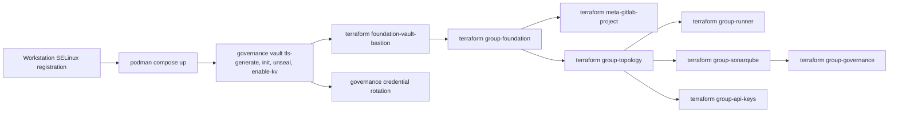

# Parent Group Governance

This repository is the upstream governance root of a single developer workstation. Three concerns belong to this repository: the SELinux configuration of the host, the container services running under rootless Podman, and the GitLab group topology declared through Terraform. A Go command line tool named `governance` is the operator entry point for every runtime action.

## Section 1. Repository Scope

### Item A. Ownership Boundary

Four assets are owned here:

- The workstation SELinux policy module, together with the persistent file context registry covering every local repository on the host.
- The Bastion Vault instance acting as the trust root for every downstream platform repository.
- The GitLab group topology under the `csning1998-lab` namespace, including group labels, group CI variables, the shared runner, and the SonarQube analysis token.
- The `governance` CLI, whose source resides under `tools/governance`.

A downstream platform repository consumes the Bastion Vault instance and the GitLab topology declared here. A downstream repository MUST NOT redeclare either asset.

### Item B. Directory Layout

| Path                 | Contents                                                                                 |
| -------------------- | ---------------------------------------------------------------------------------------- |
| `ansible/`           | The `workstation_selinux` role, the local inventory, and the host playbook               |
| `terraform/layers/`  | Eight independently applied Terraform layers, each holding its own remote state          |
| `terraform/modules/` | Three shared modules consumed by the layers                                              |
| `tools/governance/`  | Go source of the `governance` CLI, with its own design document                          |
| `vault/`             | `vault.hcl`, the raft storage directory, the TLS material, and the unseal key            |
| `compose.yml`        | Declaration of every container service on the host                                       |
| `credentials.yaml`   | Declarative list of the infrastructure passwords which the CLI rotates                   |
| `.githooks/`         | Secret scanning and commit message hooks executed through short lived containers         |
| `.gitlab/`           | CODEOWNERS, the merge request template, the linter configuration, and the tagging schema |

Paths holding runtime state are excluded from version control. The excluded set comprises `vault/data/`, `vault/keys/`, `vault/tls/`, `sonarqube/`, `gitlab-runner-configs/`, `.env`, and the compiled `governance` binary.

### Item C. Bootstrap Order

The dependency chain begins at the SELinux registration and ends at the group layers, because every later stage reads a secret out of the Bastion Vault instance provisioned by an earlier stage.



## Section 2. Host Prerequisites

### Item A. Development Machine Reference

The following specification is recorded for reference alone. Clauses in this document do not depend on the listed hardware.

- **Chipset:** Intel® HM770
- **CPU:** Intel® Core™ i7-14700HX
- **RAM:** Micron Crucial Pro 64 GB (32 GB × 2) DDR5-5600
- **SSD:** WD PC SN560 1 TB

### Item B. Required Host Tools

Three binaries MUST resolve on `PATH` before any Terraform layer is applied: `terraform`, `vault`, and `ansible`. The CLI reports the presence of each binary.

```bash
./governance env verify
```

Rootless Podman MUST be running under the operator account, because the Podman API socket beneath `/run/user/<uid>/podman/` is the transport used by the GitLab runner.

## Section 3. SELinux Configuration

Every service declared in `compose.yml` runs under rootless Podman on a host with SELinux in enforcing mode. Each bind mount originates from a path beneath the user home directory, whose policy default type is `user_home_t`. A process confined as `container_t` does not hold access to `user_home_t`, which makes an explicit `container_file_t` label mandatory on every mount source.

### Item A. Standing Conventions

Four conventions MUST hold for every service declared in `compose.yml`.

1.  A volume declaration MUST NOT carry a relabel flag. Neither `:z` nor `:Z` MUST appear on any volume line. Item G states the failure mode produced by a relabel flag.
2.  The setting `security_opt: label=disable` MUST NOT appear on a service which runs continuously. Disabling label separation removes confinement rather than resolving the underlying label mismatch.
3.  Every mount source path MUST be registered through `semanage fcontext`. The registration establishes `container_file_t` as the policy default instead of a manually applied label.
4.  A service which accesses the rootless Podman socket MUST declare `label=type:container_engine_t`. The policy module described in Item C supplies the permissions required by the named type.

### Item B. Applying the Workstation Role

Registration of file contexts requires root privileges. The playbook `ansible/playbooks/workstation_selinux.yaml` is the single operator path, and the CLI is the supported invocation.

```bash
ansible-galaxy collection install -r ansible/requirements.yaml
./governance ansible selinux
```

The CLI injects `workstation_selinux_home` from the operator home directory, because `become: true` gathers facts as root and resolves `ansible_facts.user_dir` to `/root`. The role asserts the injected value before any task runs. The role then executes three stages.

1.  Stage A installs the local policy module described in Item C. Compilation is skipped when the module is already present at the current version.
2.  Stage B registers every anchored file context specification, then restores drifted labels. A dry run of `restorecon -RFn` is executed first on each target, and `restorecon -RFv` is applied only where the dry run reports a difference. A third block restores the label of every user session Podman API socket directory.
3.  Stage C removes unanchored specifications. An unanchored specification such as `vault(/.*)?` matches every basename on the filesystem during a full relabel, which labels unrelated directories as `container_file_t`.

The `-F` flag is mandatory, because the type `container_file_t` appears in `/etc/selinux/targeted/contexts/customizable_types`, whose entries `restorecon` leaves untouched without the flag. Omitting the flag produces `not reset as customized by admin` for each path.

A correct label reads as `container_file_t:s0` without a category suffix. An empty category set is dominated by every possible container category, which keeps a bare `container_file_t:s0` label readable by every service regardless of the category assigned at container startup.

### Item C. The Policy Module

The default policy does not grant any `connectto` permission on the container runtime socket. The module source resides at `ansible/roles/workstation_selinux/files/workstation_nnp_container_runtime.te` and carries three grant groups.

- A parent process with `NoNewPrivs=1` requires `process2 nnp_transition` on each domain transition. The module grants the transition from `unconfined_t` to `container_runtime_t`, and the transition from `container_runtime_t` to `iptables_t`.
- The rootless network backend `pasta_t` inherits the parent PTY when Podman starts from a graphical terminal. The module grants PTY read and write to `pasta_t`, plus an append permission on `config_home_t`. The netavark helper running as `iptables_t` inherits the same PTY and receives the same PTY grant.
- The GitLab runner creates `podman.sock` beneath a `user_tmp_t` parent directory. The module grants socket and directory writes to `container_engine_t` on `user_tmp_t`.

The module operates at the SELinux type level and stays independent of the MCS category handling described in Item B. Installing or removing the module does not affect category drift.

### Item D. Registered File Contexts

The authoritative registry is `workstation_selinux_fcontext_present` in `ansible/roles/workstation_selinux/defaults/main.yaml`. The table below summarizes the current registry. Every pattern is anchored beneath the operator `GitLab` directory unless the row states a system wide scope.

| Repository                              | Registered Path Pattern                                                                                          | Consumed By                                |
| --------------------------------------- | ---------------------------------------------------------------------------------------------------------------- | ------------------------------------------ |
| `parent-group-governance`               | `(vault\|sonarqube)(/.*)?` and `.git(/.*)?`                                                                      | Bastion Vault, SonarQube, the commit hooks |
| `meta-platform`                         | `(vault\|sonarqube\|runner-config)(/.*)?` and `.git(/.*)?`                                                       | Downstream platform services and hooks     |
| `generic-agent-criteria-source`         | `.git(/.*)?`                                                                                                     | The commit hooks                           |
| `terraform-provider-sshclient`          | `.git(/.*)?`                                                                                                     | The commit hooks                           |
| `on-premise-agent`                      | `(vault\|ollama_data\|open-webui_data\|searxng_data\|pipelines\|openclaw\|openclaw_data)(/.*)?` and `.git(/.*)?` | Local service bind mounts and hooks        |
| `on-premise-gitlab-deployment`          | The full repository tree                                                                                         | Arbitrary IaC bind mounts                  |
| `personal/second-brain`                 | `(postgres-data\|db/migrations)(/.*)?` and `.git(/.*)?`                                                          | Postgres bind mounts and hooks             |
| `personal/app-content-matter`           | `.git(/.*)?`                                                                                                     | The commit hooks                           |
| `personal/LaTeX_Documents`              | `.git(/.*)?`                                                                                                     | The commit hooks                           |
| `personal/monte-carlo-portfolio-trader` | `.git(/.*)?`                                                                                                     | The commit hooks                           |
| `template/template-project`             | `.git(/.*)?`                                                                                                     | The commit hooks                           |
| `template/template-project-fullstack`   | `.git(/.*)?`                                                                                                     | The commit hooks                           |
| `gitlab-ci-with-code-reviewer`          | `runner-config(/.*)?` and `.git(/.*)?`                                                                           | A GitLab runner and the commit hooks       |
| System wide                             | `/run/user/[0-9]+/podman(/.*)?`                                                                                  | The rootless Podman API socket             |

A repository without a `compose.yml` file registers `.git(/.*)?` alone, which limits container execution scope to the short lived Git lifecycle hooks.

The service `iac-runner` inside `on-premise-gitlab-deployment` is exempt from the conventions in Item A. Arbitrary Infrastructure as Code execution requires a bind mount of the entire project root, which makes a path restricted registration unworkable. The named service retains `security_opt: label=disable`.

### Item E. Verification

1.  Each container MUST report a non-empty process label. An empty value indicates disabled label separation.

    ```bash
    for c in parent-group-governance-vault-bastion parent-group-governance-sonarqube-postgres \
            parent-group-governance-sonarqube parent-group-governance-gitlab-runner; do
        printf '%s\t' "$c"
        podman inspect "$c" --format '{{.ProcessLabel}}'
    done
    ```

2.  The following command reports the distinct label set carried by every file beneath the registered mount sources. The reported set MUST contain the single entry `container_file_t:s0` without a category suffix.

    ```bash
    ls -RZ vault sonarqube | grep -o 'container_file_t:s0[^ ]*' | sort -u
    ```

3.  The runner MUST establish a connection to the Podman socket. The following request confirms access through an HTTP status of 200.

    ```bash
    podman exec parent-group-governance-gitlab-runner \
        curl -s -o /dev/null -w '%{http_code}\n' \
        --unix-socket /run/podman/podman.sock http://d/v1.41/_ping
    ```

4.  The policy default of any path is retrieved through `matchpathcon`, which MUST report `container_file_t:s0` for every registered mount source.

    ```bash
    matchpathcon vault/data sonarqube/data
    ```

### Item F. Diagnosing a Denial

1.  Attribution requires the audit log, because an access failure surfaces inside the container as an ordinary permission error. The following command isolates denials raised by confined container processes.

    ```bash
    sudo ausearch -m avc -ts recent | grep 'scontext=system_u:system_r:container'
    ```

2.  A denial raised by `pasta_t` against `config_home_t` or `data_home_t` is unrelated to the services declared here. Such a denial originates from a file descriptor inherited by the rootless network backend from the process launching Podman.

3.  A denial whose `tcontext` carries a non-empty MCS category on a path beneath `vault/` or `sonarqube/` indicates category drift. Item B restores the baseline, and Item G identifies the class of tooling causing the drift.

4.  A denial whose `tcontext` names `container_runtime_t` with class `unix_stream_socket` and permission `connectto` indicates an absent policy module, or a service declaration missing the `container_engine_t` type.

### Item G. Recursive Relabeling from Local Tooling

The Podman relabel flags `:z` and `:Z` each rewrite the MCS category of every file beneath the mounted path at container start. A tool mounting the repository root therefore rewrites `vault/` and `sonarqube/` as a side effect, even where the tool does not relate to the services declared in `compose.yml`. The resulting category matches neither the short lived container nor any running service. A denial on the raft storage path can fail a Vault write, which panics the process and loses the unseal state.

Both hooks under `.githooks/` read the repository without writing to the repository. Each hook mounts `.git` read only without declaring a relabel flag. Any future local tool mounting the repository root, or mounting any ancestor of `vault/` and `sonarqube/`, MUST avoid `:z` and `:Z` for the same reason.

### Item H. Relabeling After Repository Relocation

The registration in Item B binds `container_file_t` to a literal path pattern rather than to the repository as a logical entity. Moving or renaming the repository directory leaves the registered rule pointing at an absent path, while the new path falls back to the parent directory default type `user_home_t` at the next `restorecon` invocation. The policy module installed in Item C is unaffected by relocation, because the module grants a permission to an SELinux type rather than to a filesystem path.

1.  Confirm the current registration before removal, because the deletion in the next step requires an exact match of the registered string.

    ```bash
    sudo semanage fcontext -l | grep <PREVIOUS_PATH>
    ```

2.  Update `workstation_selinux_fcontext_present` and `workstation_selinux_fcontext_absent` in the role defaults to name the current path, then apply the role again.

    ```bash
    ./governance ansible selinux
    ```

3.  An intra-filesystem move operation preserves the security context of each affected inode. A container running at the time of relocation therefore continues execution without interruption. Relabeling MUST be performed prior to any subsequent container recreation, manual `restorecon` invocation, or system wide relabel event.

## Section 4. Container Services

### Item A. Service Inventory

| Service         | Image                                  | Network                                  | Notes                                                                 |
| --------------- | -------------------------------------- | ---------------------------------------- | --------------------------------------------------------------------- |
| `vault-server`  | `hashicorp/vault:2.0`                  | Host namespace                           | Runs as `HOST_UID:HOST_GID` with `IPC_LOCK` and raft storage          |
| `gitlab-runner` | `gitlab/gitlab-runner:v19.0.1`         | Host namespace                           | Declares `label=type:container_engine_t` and mounts the Podman socket |
| `sonarqube`     | `sonarqube:26.7.0.124771-community`    | `sonarqube-internal`, `sonarqube-ci-net` | Published on `127.0.0.1:9000` alone                                   |
| `sonarqube-db`  | `postgres:18-alpine3.24`               | `sonarqube-internal`                     | Credentials injected from `SONARQUBE_DB_PASSWORD`                     |
| `commitlint`    | The reviewer image of the CI component | Default                                  | Short lived, invoked by `.githooks/commit-msg`                        |
| `gitleaks`      | `zricethezav/gitleaks:v8.30.1`         | Default                                  | Short lived, invoked by `.githooks/pre-commit`                        |

The bridge network `sonarqube-ci-net` carries a literal name, because the `[runners.docker]` section of the runner configuration references the same name as its `network_mode`. A CI job container therefore reaches SonarQube by service name without any published host port.

### Item B. The Vault Listener Startup Guard

The file `vault/vault.hcl` declares two TLS listeners. The first listener binds `127.0.0.1:8200` for the local operator, Terraform, and the CLI. The second listener binds `172.16.0.1:8200` for guest virtual machines connecting to the host over the hypervisor publish network.

Vault exits when any declared TCP listener fails to bind. The host network namespace can present the address `172.16.0.1` later than the start of PID 1, which makes an unconditional start unreliable. The entrypoint therefore polls the host namespace for the address at 0.2 second intervals up to 150 attempts before executing the server.

## Section 5. The Governance CLI

The `governance` binary is built from `tools/governance`. The full design of the rotation state machine resides in `tools/governance/README.md`. This section covers the operator surface alone.

```bash
cd tools/governance && go build -o ../../governance ./cmd/governance
```

### Item A. Dual Interface

The CLI exposes the same operations through two interfaces. Invocation without arguments opens the interactive menu, which suits manual operation. Invocation with a subcommand path runs one operation without prompting for a selection, which suits scripted use. Both interfaces dispatch into the same operation functions.

### Item B. Operation Inventory

| Menu Entry                                                        | Subcommand                         | Effect                                                                     |
| ----------------------------------------------------------------- | ---------------------------------- | -------------------------------------------------------------------------- |
| `[Vault] Set up TLS for Bastion Vault`                            | `vault tls-generate`               | Clears `vault/tls` and issues a fresh CA with a server certificate         |
| `[Vault] Initialize Bastion Vault`                                | `vault init`                       | Initializes raft storage and records the unseal key with the root token    |
| `[Vault] Enable KV-v2 Engine`                                     | `vault enable-kv`                  | Mounts the KV version 2 engine at the path `secret`                        |
| `[Vault] Unseal Bastion Vault`                                    | `vault unseal`                     | Submits the recorded unseal key                                            |
| `[Credentials] Rotate Credentials`                                | `vault <credential-key>`           | Generates a password, deploys the password, and commits the value to Vault |
| `[Credentials] Reconcile Credentials with Live Service`           | `vault reconcile <credential-key>` | Pushes the value held by Vault out to a drifted live service               |
| `[Hypervisor] Apply workstation SELinux policy and file contexts` | `ansible selinux`                  | Runs the playbook described in Section 3 Item B                            |
| `[Hypervisor] Verify host IaC tools`                              | `env verify`                       | Reports the presence of Terraform, Vault, and Ansible on `PATH`            |

Each credential key listed in `credentials.yaml` becomes one subcommand under `vault`, and one more under `vault reconcile`. The menu presents the same keys as a multiple selection prompt, annotated with whether Vault already holds a value for the given key. The interactive banner reports the Bastion Vault state as stopped, uninitialized, sealed, or unsealed before any prompt appears.

### Item C. Environment File Lifecycle

Every subcommand other than the bare root command bootstraps `.env` before running. The bootstrap populates host identity and Vault defaults, and the file is rewritten through a temporary file with an atomic rename. Nine keys are managed.

| Key                     | Source                                                                              |
| ----------------------- | ----------------------------------------------------------------------------------- |
| `PROJECT_ROOT`          | The directory holding the `.git` entry nearest above the working directory          |
| `BASTION_VAULT_ADDR`    | The `vault.address` field of `credentials.yaml`, falling back to the existing value |
| `BASTION_VAULT_CACERT`  | The CA path beneath `vault/tls`                                                     |
| `VAULT_TOKEN`           | Synchronized from the Vault token helper file after a successful unseal             |
| `HOST_UID`, `HOST_GID`  | The operator account identifiers, consumed by `compose.yml`                         |
| `UNAME`, `UHOME`        | The operator user name and home directory                                           |
| `SONARQUBE_DB_PASSWORD` | Generated once from `crypto/rand` at first bootstrap                                |

### Item D. Credential Rotation

The file `credentials.yaml` declares every rotatable infrastructure account. A declaration names the Vault mount, the Vault path, the generated length, and the service mechanism performing the remote password change. The current declaration covers the SonarQube administrator account alone.

Rotation applies a write ahead staging protocol across the Vault document and the external service, guarded by a Check and Set advisory lock. The protocol, the recovery paths, and the boundary conditions are documented in `tools/governance/README.md`.

## Section 6. Terraform Layers

### Item A. State Backend and Authentication

Every layer stores state in the GitLab HTTP backend under the project hosting this repository, with one state name per layer. Three credential sources feed the providers, and the module `terraform/modules/local-credential-contexts` centralizes each source.

- The HTTP backend and every `terraform_remote_state` block authenticate through the `read_api` token in `~/.terraform.d/credentials.tfrc.json`.
- The Vault provider connects to `https://172.16.0.1:8200` with the CA at `vault/tls/ca.pem`, authenticating through the token helper file `~/.vault-token`. Reading the token from the helper file breaks the cyclic authentication dependency present during initialization.
- The GitLab provider reads a token from the ephemeral Vault secret `secret/parent-group-governance/state-backend`. An ephemeral read keeps the token out of the persisted state of the consuming layer.

### Item B. Layer Inventory

| Layer                      | Responsibility                                                                                    | Upstream State     |
| -------------------------- | ------------------------------------------------------------------------------------------------- | ------------------ |
| `foundation-vault-bastion` | The PKI root, the issuing intermediate, the `terraform-admin` policy, and the AppRole credentials | None               |
| `group-foundation`         | The top level group `Personal Lab` at path `csning1998-lab`                                       | None               |
| `meta-gitlab-project`      | The GitLab project hosting this repository and every Terraform state                              | `group-foundation` |
| `group-topology`           | Every subgroup and nested subgroup beneath the top level group                                    | `group-foundation` |
| `group-governance`         | Group labels and the group CI variables sourced from Vault                                        | `group-topology`   |
| `group-runner`             | The group runner registration and the rendered `gitlab-runner-configs/config.toml`                | `group-topology`   |
| `group-sonarqube`          | The SonarQube global analysis token, written into Vault                                           | None               |
| `group-api-keys`           | One Google Gemini API key per repository with AI review enabled                                   | None               |

The layer `foundation-vault-bastion` issues the credentials consumed by every later layer. The PKI hierarchy comprises a Root CA signing the Bootstrap Issuing Intermediate alone, and the intermediate issues every leaf certificate. The Root CA certificate resource declares `prevent_destroy`, because destruction invalidates every downstream certificate without a rotation handler.

The layer `group-governance` publishes four masked group variables read out of Vault: `CLAUDE_MR_REVIEWER`, `GEMINI_MR_REVIEWER`, `SONAR_TOKEN`, and `TAG_PUSH_TOKEN`. A Personal Access Token supplies the reviewer variables, because Project Access Token creation is unavailable under the GitLab Free tier.

The layer `group-sonarqube` owns the path prefix `infrastructure/token/`, and the CLI owns the path prefix `infrastructure/credentials/`. The separation keeps one writer per Vault path.

### Item C. Apply Order

The order follows the upstream state column of Item B. The Bastion Vault instance MUST be unsealed with the KV version 2 engine mounted before the first layer is applied.

1.  Apply `foundation-vault-bastion`.
2.  Apply `group-foundation`.
3.  Apply `meta-gitlab-project` and `group-topology` in either order.
4.  Apply `group-runner`, then start the runner service declared in `compose.yml`.
5.  Apply `group-sonarqube` once the SonarQube service becomes ready.
6.  Apply `group-governance`, which reads the token written by `group-sonarqube`.
7.  Apply `group-api-keys` at any point after `group-foundation`.

### Item D. Shared Modules

- `local-credential-contexts` does not declare any resource. The module exposes the Bastion Vault endpoint, the CA path, the Vault token, and the GitLab state authentication block as outputs. Every layer reads the endpoint from the module instead of redeclaring a default.
- `project-baseline` creates one GitLab project with a fixed merge policy, branch protection on `main`, and the optional AI review variables. The caller supplies every environment specific value.
- `vault-credential` generates a set of random passwords and writes one KV version 2 secret. The module is the single generation point for the secrets under its control.

## Section 7. Continuous Integration

The pipeline includes five components published by the `gitlab-ci-with-code-reviewer` project at version 1.5.1.

- The `core` component runs the AI merge request reviewer and the SonarQube analysis.
- The `iac-terraform` component runs Checkov across the Terraform tree. Four checks are skipped: three GitLab checks require a paid subscription tier, and `CKV_TF_1` demands commit pinned Git URLs, which conflicts with the immutable semantic versions already used from the GitLab Terraform Registry.
- The `iac-ansible` component lints every file beneath `ansible/`.
- The `lang-go` component builds, vets, and tests the module under `tools/governance`.
- The `auto-tag` component tags the default branch on push, treating the repository as a single module per `.gitlab/versioning.yml`.

Two local hooks run before a commit reaches the remote. The hook `.githooks/pre-commit` runs gitleaks against the staged changes. The hook `.githooks/commit-msg` runs commitlint against the message. Activation requires one command.

```bash
git config core.hooksPath .githooks
```
