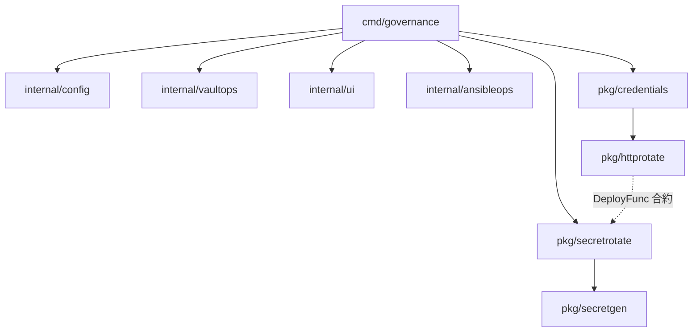
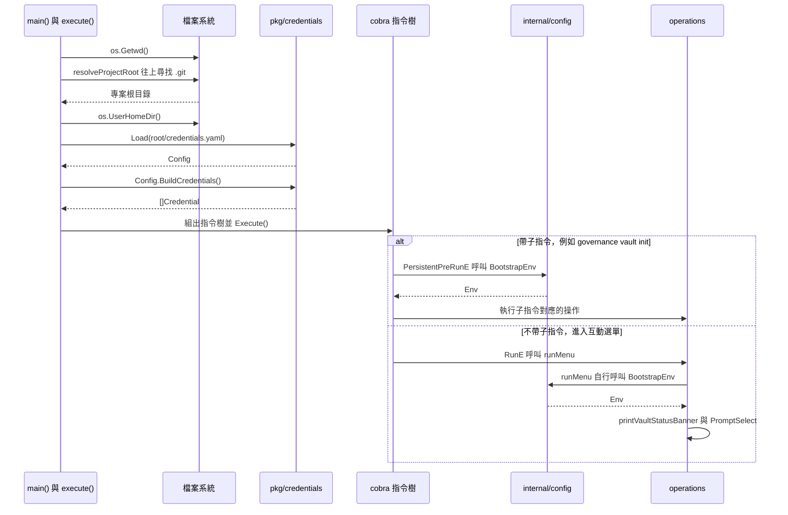
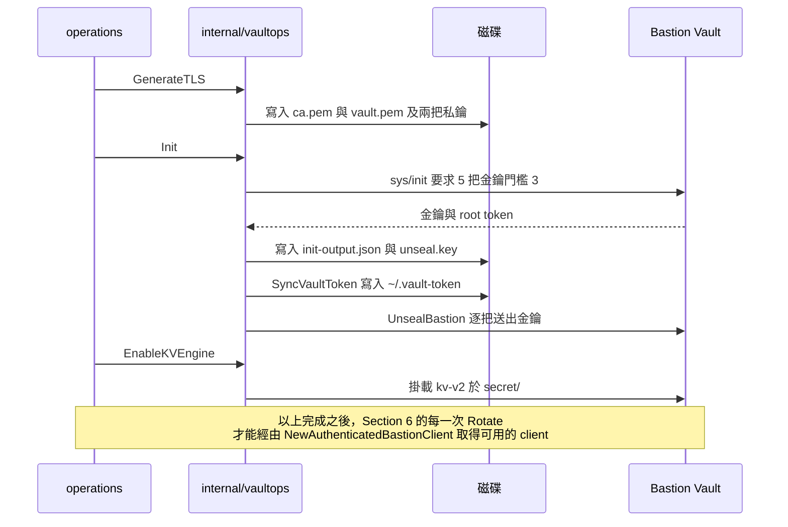

# tools/governance 設計文件

這份文件依照真實執行 DAG 說明 `tools/governance` 整支工具，範圍涵蓋 `cmd/governance`、`internal/config`、`internal/vaultops`、`internal/ui`、`internal/ansibleops`、`pkg/credentials`、`pkg/secretgen`、`pkg/httprotate`、`pkg/secretrotate` 九個套件

## Section 1. Domain Terminology and Package Overview

### Item A. Lexicon

每個術語在整份文件與對應程式碼中，只能對應到單一工程定義：

- `Document`：Vault KV2 引擎裡用掛載點（Mount）跟路徑（Path）定位的完整 JSON 文件
- `Field`：Document 裡面存的單一鍵值名稱
- `Secret`：基礎架構服務需要的安全憑證字串
- `Password`：給服務登入用、滿足複雜度要求的純文字密碼
- `RandomToken`：用 `crypto/rand` 產生並編碼成可列印字串的亂數，給系統內部當金鑰或識別碼
- `RawLockRecord`：直接從 Document 讀出來、還沒檢查過期時間的原始鎖資料
- `ActiveLock`：確認過期時間還沒到的有效互斥鎖
- `MetadataRecord`：Vault KV2 在 metadata 端點記錄的版本歷史與系統資料
- `LiveSecret`：外部目標服務目前實際持有、可以正常登入的密碼
- `SealStatus`：一次查詢得到的 Vault 可連線性、初始化狀態、封印狀態三者組合
- `HostFacts`：從執行這支工具的作業系統帳號讀出的 UID、GID、使用者名稱
- `Paths`：`vaultops` 套件用來統一解析 Vault 相關檔案位置的組態物件
- `Resolve`：依照當下的情境或預設值算出目標路徑、位址或參數
- `Format`：把輸入的資料按照特定格式或命名規則組裝成字串
- `Parse`：把沒有結構的字串或泛用型別轉成具體的型別
- `Probe`：呼叫外部系統檢查是否活著，或是驗證密碼能不能用
- `Inspect`：讀取目標的狀態並轉成專用的列舉值
- `Read`：從快照、磁碟或遠端讀出資料物件
- `Patch`：只修改現有文件的特定欄位
- `Build`：經過檢查與轉換之後，建構出完整的物件清單
- `Compute`：依照當前限制或計算公式算出時間長度或數值
- `Pick`：從指定的字元集或位元組陣列隨機挑一個元素
- `Bootstrap`：在程式每次啟動時，把設定檔或執行環境補齊到可用狀態
- `Dispatch`：依照使用者選定的介面把控制權轉交給對應的操作函數
- `Verify`：檢查外部相依工具是否存在於 PATH 上
- `Rotate`：讀出舊密碼、產生新密碼、部署到外部服務、寫回 Vault 的完整流程
- `Reconcile`：把 Vault 現有的密碼值單向推送到外部服務，讓外部服務追上 Vault
- `Deploy`：對外部服務執行一次密碼變更，同時驗證舊密碼是否仍然有效
- `Stage`：在正式提交前，把即將發生的變更先寫進附屬欄位當作復原依據
- `Commit`：把已經驗證過的結果正式寫回 Vault 主要欄位
- `Acquire`：透過 CAS 條件寫入以取得一把互斥鎖
- `Release`：確認鎖的持有者是自己之後，透過 CAS 條件重置互斥鎖
- `Recover`：從上一輪中斷的紀錄裡判斷要接受還是放棄此紀錄，得以使流程回到一致狀態
- `Generate`：依照字元類別限制產生一組隨機密碼

### Item B. Package Boundaries and Responsibilities

- `cmd/governance` 是 entry point 與 Golang Cobra 組裝層，本身不含業務邏輯。主要功能是負責建立 `app`、組出 cobra 指令樹與互動選單，並把控制權交接到對應的操作函數。詳見 Section 2 與 Section 9
- `internal/config` 主要管理 `.env` 檔案的生命週期，並在啟動時補齊主機身份欄位、檢查 Terraform 與 Vault 與 Ansible 是否在 PATH 上。詳見 Section 2
- `internal/vaultops` 主要管理 Bastion Vault 本身的生命週期，包含產生 TLS 憑證、初始化、解封印、啟用 KV 引擎、同步 root token 等。詳見 Section 4
- `internal/ui` 是終端機格式化輸出與互動輸入，包含選單、確認提示、密碼提示。詳見 Section 9
- `internal/ansibleops` 透過薄封裝的 `go-ansible` 執行 playbook 並注入 `ANSIBLE_CONFIG`。詳見 Section 9
- `pkg/credentials` 負責解析 `credentials.yaml` 宣告檔，轉換為一組可執行的 `Credential`。詳見 Section 3
- `pkg/secretgen` 會依照呼叫端指定的字元類別產生隨機密碼，保證每個要求的類別至少出現一次。詳見 Section 6
- `pkg/httprotate` 是 `DeployFunc` 的其中一種實作，把外部服務的換密碼介面包成一個 Basic Auth 表單 POST。詳見 Section 6
- `pkg/secretrotate` 是整個工具的主軸，負責狀態機排程、雙重寫入防護、CAS 建議鎖與 reconcile 等。詳見 Section 5 到 Section 7 Item D

### Item C. Package Dependency Overview

套件的相依關係可以參考下圖



其中可以注意到 `pkg/httprotate` 跟 `pkg/secretrotate` 之間是介面合約關係，主要是

- `httprotate.FormSpec.Deploy` 的簽章必須滿足 `secretrotate.DeployFunc`
- `pkg/secretrotate` 完全不需要 import `pkg/httprotate`

兩者的耦合只在執行期由 `pkg/credentials` 的 `resolveDeployFunc` 進行組裝。詳情可參考 Section 3 Item A.3 的說明

## Section 2. 進入點與執行環境

程式從 `main()` 進入後，在讀到 `credentials.yaml` 之前必須先解決

1.  專案根目錄位置
2.  `.env` 是否備妥

這些會決定後續的函數取用檔案的路徑、以及需要連接到的 Vault 位址，且進入點順序不能調換。有關 Section 2 內容，可以參考以下時序圖



### Item A. 專案根目錄的定位

`execute()` 能直接拿到的只有當前工作目錄，但工具真正需要的是專案根目錄，因為 `credentials.yaml`、`.env`、`vault/tls/`、`vault/keys/`、`ansible/` 全部都以根目錄為基準。`resolveProjectRoot` 負責把前者換算成後者：

```go
func resolveProjectRoot(start string) (string, error) {
    dir := start
    for {
        _, err := os.Stat(filepath.Join(dir, ".git"))
        if err == nil {
            return dir, nil
        }
        if !errors.Is(err, fs.ErrNotExist) {
            return "", err
        }
        parent := filepath.Dir(dir)
        if parent == dir {
            return "", errors.New("no .git entry found upward from " + start)
        }
        dir = parent
    }
}
```

錨點選擇 `.git` 而不是 `credentials.yaml` 或 `go.mod`，兩個替代方案各自會失敗：`credentials.yaml` 在還沒採用密碼輪替的專案裡本來就不存在，這是 Section 3 Item A 第 2 點刻意保留的情境，拿不存在的檔案當錨點會讓工具在那些專案裡直接中止；`go.mod` 在 `tools/governance/` 底下也有一份，往上找會停在工具自己的目錄，得到的根目錄會比預期淺一層，後續所有路徑都會算錯。

三個終止條件分別對應三種不同的狀況，不能合併處理。`err == nil` 代表找到了。`errors.Is(err, fs.ErrNotExist)` 代表這一層確實沒有 `.git`，可以安全地往上一層繼續找。其餘的 `err` 直接回傳而不繼續往上，因為權限不足或讀取失敗跟「這層沒有」是兩件事：如果把它們一律當成沒有而繼續往上爬，工具會在一個其實有 `.git` 但當下讀不到的目錄上方繼續尋找，最後回報一個與真實原因無關的「找不到」，操作者會往錯誤的方向排查。

`parent == dir` 是檔案系統根目錄的判斷方式。`filepath.Dir("/")` 回傳 `/` 自己，所以這個等式成立時代表已經爬到頂，再往上沒有意義。

這段邏輯帶來一個系統層級的硬約束：這支工具必須在 git 工作區內執行。在工作區外執行會在這一步就中止，不會進到後面任何一個步驟。

### Item B. `.env` 的資料結構與序列化

`.env` 由 `internal/config` 的 `Env` 型別負責讀寫，這個型別刻意用兩個欄位記錄同一份資料：

```go
type Env struct {
    path   string
    order  []string
    values map[string]string
}
```

`values` 負責查詢，`order` 負責保留鍵在檔案裡原本的宣告順序。只用 map 是不行的，因為 Go 的 map 迭代順序是隨機的，每次 `Save` 寫回去的行序都會不一樣，`.env` 會在每次執行後產生一份與內容無關的 diff，讓版本控制上的真實變更被雜訊淹沒。

解析單行的規則由一條正規式決定：

```go
var envLineRe = regexp.MustCompile(`^([A-Za-z_][A-Za-z0-9_]*)\s*=\s*("(?:[^"\\]|\\.)*"|[^\r\n]*)\s*$`)
```

值的部分接受兩種形式，帶雙引號的字串或是一路吃到行尾的裸值，因為 `.env` 是人會手動編輯的檔案，操作者不一定會補上引號。比對不到的行直接跳過而不報錯，註解與空行因此被自動忽略。

```go
func decodeValue(raw string) string {
    if len(raw) >= 2 && raw[0] == '"' && raw[len(raw)-1] == '"' {
        if unquoted, err := strconv.Unquote(raw); err == nil {
            return unquoted
        }
    }
    return raw
}
```

`decodeValue` 只在前後都是雙引號時才嘗試 `strconv.Unquote`，而且解碼失敗時退回原始字串而不是回傳錯誤。這是因為一個引號不成對或含有非法跳脫序列的值，多半是手動編輯留下的，把整個 `.env` 判定為無法解析會讓工具完全無法啟動，代價遠大於保留那一行的原始字面值。

寫回去的時候一律正規化成帶引號的形式，並且經由暫存檔換名完成：

```go
func (e *Env) Save() error {
    var b strings.Builder
    for _, key := range e.order {
        fmt.Fprintf(&b, "%s=%q\n", key, e.values[key])
    }

    tmp := e.path + ".tmp"
    if err := os.WriteFile(tmp, []byte(b.String()), 0o600); err != nil {
        return fmt.Errorf("config: write %s: %w", tmp, err)
    }
    if err := os.Rename(tmp, e.path); err != nil {
        return fmt.Errorf("config: replace %s: %w", e.path, err)
    }
    return nil
}
```

先寫暫存檔再 `os.Rename` 是因為同一個檔案系統上的換名是原子操作。如果直接覆寫原檔，在寫入途中斷電或程序被中止，`.env` 會變成一份只有前半段的檔案，而這份檔案裡存著 `VAULT_TOKEN` 與 `SONARQUBE_DB_PASSWORD`，截斷的後果是操作者失去 Vault 的存取權，同時資料庫密碼變成一個沒有任何地方記載的值。權限固定為 `0o600` 也是同一個理由：這個檔案存的是明文憑證，不應該讓同一台機器上的其他帳號讀到。

最後是把 `.env` 展開成子行程環境變數的路徑：

```go
func (e *Env) Environ() []string {
    resolved := map[string]string{}
    out := make([]string, 0, len(e.order))

    for _, key := range e.order {
        expanded := envRefRe.ReplaceAllStringFunc(e.values[key], func(ref string) string {
            refKey := envRefRe.FindStringSubmatch(ref)[1]
            if v, ok := resolved[refKey]; ok {
                return v
            }
            return os.Getenv(refKey)
        })
        resolved[key] = expanded
        out = append(out, key+"="+expanded)
    }
    return out
}
```

`${VAR}` 的解析有一個順序上的限制必須說清楚：`resolved` 是隨著迴圈逐步填入的，所以只有宣告在自己前面的鍵才查得到，引用一個宣告在自己後面的鍵會落到 `os.Getenv`，通常得到空字串。這個限制直接決定了 Item C 裡 `populateNewEnv` 的鍵順序不能任意調換，`BASTION_VAULT_CACERT` 的值是 `${PROJECT_ROOT}/vault/tls/ca.pem`，`PROJECT_ROOT` 必須排在它前面才會被展開成實際路徑。相對地 `UHOME` 的值 `${HOME}` 永遠取自主機環境變數，因為 `.env` 裡沒有 `HOME` 這個鍵。

### Item C. `.env` 的補齊流程

`BootstrapEnv` 是每次執行都會跑的補齊動作，負責讓 `.env` 從不存在或不完整的狀態變成可用：

```go
func BootstrapEnv(root string, out *ui.Printer) (*Env, error) {
    envPath := filepath.Join(root, ".env")
    facts, err := DetectHostFacts()
    if err != nil {
        return nil, err
    }

    e, err := Load(envPath)
    if err != nil {
        return nil, err
    }

    _, statErr := os.Stat(envPath)
    isNewFile := os.IsNotExist(statErr)

    if isNewFile {
        out.Print(ui.Info, "Creating new .env file...")
        if err := populateNewEnv(e, root, facts); err != nil {
            return nil, err
        }
    } else if err := patchExistingEnv(e, root, facts, out); err != nil {
        return nil, err
    }

    if err := e.Save(); err != nil {
        return nil, err
    }
    return e, nil
}
```

檔案存不存在要另外用 `os.Stat` 判斷，不能靠 `Load` 的回傳值推論，因為 `Load` 對不存在的檔案回傳的是一個初始化好的空 `Env` 而不是錯誤，跟一個存在但內容全被註解掉的檔案在回傳值上無法區分。這兩種情況要走的分支不同，所以判斷必須獨立做一次。

新建與既有兩條分支的差別，在於哪些欄位可以被覆寫：

```go
func patchExistingEnv(e *Env, root string, facts HostFacts, out *ui.Printer) error {
    e.Set(KeyHostUID, strconv.Itoa(facts.CurrentUID))
    e.Set(KeyHostGID, strconv.Itoa(facts.CurrentGID))
    e.Set(KeyProjectRoot, root)
    if e.Get(KeyDevVaultAddr) == "" {
        e.Set(KeyDevVaultAddr, "https://172.16.0.1:8200")
    }
    if e.Get(KeyDevVaultCACert) == "" {
        e.Set(KeyDevVaultCACert, "${PROJECT_ROOT}/vault/tls/ca.pem")
    }
    if e.Get(KeySonarQubeDBPassword) == "" {
        sonarDBPassword, err := generateRandomHexToken(24)
        if err != nil {
            return err
        }
        out.Print(ui.Info, "Generated SONARQUBE_DB_PASSWORD.")
        e.Set(KeySonarQubeDBPassword, sonarDBPassword)
    }
    return nil
}
```

`HOST_UID`、`HOST_GID`、`PROJECT_ROOT` 這三個每次都無條件覆寫，因為它們描述的是「現在這台機器、現在這份 checkout」，不是操作者的選擇。Compose 檔案用 `${HOST_UID}:${HOST_GID}` 決定容器內的執行身份，如果沿用另一台機器或另一個帳號留下的舊值，掛載出來的檔案擁有者會是錯的；`PROJECT_ROOT` 同理，把儲存庫換個位置 clone 之後，舊值會讓所有衍生路徑指向一個已經不存在的目錄。

其餘欄位只在空值時補上，因為它們可能是操作者刻意設定的。`BASTION_VAULT_ADDR` 指向哪一台 Vault、`SONARQUBE_DB_PASSWORD` 是哪一組密碼，都屬於一旦被每次執行無條件覆寫就會造成實害的值：前者會讓工具連到錯誤的 Vault，後者會讓 `.env` 裡的密碼與資料庫裡已經持久化的密碼永久脫節，而資料庫本身沒有第二份紀錄可以還原。

`SONARQUBE_DB_PASSWORD` 在這裡鑄造而不是交給 `secretrotate`，是因為它沒有可以認證的對象。Section 6 的輪替流程建立在「用舊密碼登入外部服務、順勢換成新密碼」這個前提上，而這組密碼的消費者是 Compose 啟動容器時讀取的環境變數，不存在一個可以驗證舊值的線上端點。它只需要在第一次啟動時被鑄造一次，之後由 `.env` 自己保管。

主機身份的來源是 `DetectHostFacts`：

```go
func DetectHostFacts() (HostFacts, error) {
    var facts HostFacts
    u, err := user.Current()
    if err != nil {
        return facts, fmt.Errorf("config: lookup current user: %w", err)
    }
    facts.CurrentUname = u.Username
    if uid, err := strconv.Atoi(u.Uid); err == nil {
        facts.CurrentUID = uid
    }
    if gid, err := strconv.Atoi(u.Gid); err == nil {
        facts.CurrentGID = gid
    }
    return facts, nil
}
```

`user.Current()` 失敗會直接回傳錯誤，但 `Atoi` 失敗只會讓對應欄位停在零值而不回報。這是平台差異造成的取捨：`u.Uid` 在 POSIX 系統上是數字字串，在其他平台上可能不是，把非數字的情況當成致命錯誤會讓工具在那些平台上無法啟動，而 `0` 這個值在 Compose 的語境下代表 root，是一個明確到足以在使用時被看出異常的結果。

`SONARQUBE_DB_PASSWORD` 的亂數來源如下：

```go
func generateRandomHexToken(nBytes int) (string, error) {
    buf := make([]byte, nBytes)
    if _, err := rand.Read(buf); err != nil {
        return "", fmt.Errorf("config: generate password: %w", err)
    }
    return base64.RawURLEncoding.EncodeToString(buf), nil
}
```

亂數取自 `crypto/rand` 而不是 `math/rand`，因為這是一組會被長期持有的資料庫密碼，需要的是密碼學強度而不是統計上的均勻。編碼採用 `base64.RawURLEncoding`，輸出只含 URL 安全字元且不帶尾端填充，可以直接放進 `.env` 而不需要跳脫；函數名稱裡的 `Hex` 與實際採用的 base64 編碼並不一致，這一點在閱讀呼叫端時需要留意。

### Item D. 外部工具檢查

`VerifyHostEnvironment` 對應選單與 `governance env verify` 子指令，用來在真正動手之前確認三個外部執行檔存在：

```go
var hostTools = []requiredTool{
    {"terraform", "HashiCorp Terraform"},
    {"vault", "HashiCorp Vault"},
    {"ansible", "Red Hat Ansible"},
}

func VerifyHostEnvironment() []ToolCheck {
    var checks []ToolCheck
    for _, t := range hostTools {
        _, err := exec.LookPath(t.Cmd)
        checks = append(checks, ToolCheck{"Host IaC tools", t.Name, err == nil})
    }
    return checks
}
```

這個函數回傳的是一份完整的檢查結果清單，不是遇到第一個缺失就中止的錯誤。差別在於操作者拿到的資訊量：一次列出三個工具各自的狀態，操作者可以一次把缺的都裝好；遇到第一個就回傳錯誤，操作者會被迫重跑三次才能發現三個都沒裝。把「判斷有沒有裝」跟「要怎麼呈現與是否視為失敗」分開，也讓呼叫端可以自己決定要印成報表還是轉成錯誤，這部分在 Section 9 說明。

注意這裡檢查的是 PATH 上有沒有這個執行檔，不是版本是否相容。版本相容性沒有在程式層面驗證。

### Item E. 雙介面分派與 `BootstrapEnv` 的觸發時機

同一組操作有兩個入口，不帶參數執行會進互動選單，帶子指令執行會直接跑對應動作。兩者共用 `cmd/governance/operations.go` 裡同一份實作，差別只在誰負責取得參數。

`BootstrapEnv` 的觸發點因此分成兩處，由根指令上的守衛決定：

```go
PersistentPreRunE: func(cmd *cobra.Command, args []string) error {
    if cmd == rootCmd {
        return nil
    }
    env, err := config.BootstrapEnv(a.root, a.out)
    if err != nil {
        return err
    }
    a.env = env
    a.applyEnvPaths()
    return nil
},
RunE: func(cmd *cobra.Command, args []string) error {
    return a.runMenu(cmd.Context())
},
```

`cmd == rootCmd` 這個守衛存在的理由是 `runMenu` 自己也會呼叫一次 `BootstrapEnv`。cobra 在執行根指令自身的 `RunE` 之前，一樣會先跑 `PersistentPreRunE`，如果不排除這個情況，互動選單這條路徑會把 `.env` 的讀取、補齊、寫回整個流程跑兩遍。兩遍的結果雖然一致，但是多一次不必要的檔案寫入，而 `Save` 是會實際改動磁碟內容的動作。

執行子指令的路徑則一定會經過這個守衛之外的分支，因為此時 `cmd` 是子指令而不是根指令。這個安排讓每一條路徑都恰好補齊一次 `.env`。

補齊完成後由 `applyEnvPaths` 決定 Vault 位址：

```go
func (a *app) applyEnvPaths() {
    if a.env == nil {
        return
    }
    if a.bastionVaultAddr == "" {
        a.bastionVaultAddr = a.env.Get(config.KeyDevVaultAddr)
    }
}
```

只在 `a.bastionVaultAddr` 仍為空時才從 `.env` 取值，代表 `credentials.yaml` 的 `vault.address` 優先於 `.env`。這個優先順序的理由是宣告檔的層級比環境檔高：`.env` 描述的是這台機器的預設環境，`credentials.yaml` 描述的是這個專案的憑證要寫到哪裡去，後者是專案層級的決定，不應該被機器層級的預設值蓋掉。

完整的位址解析是一條三段式退回鏈，三段分別由不同套件負責：

```go
func (a *app) resolveBastionVaultAddr() string {
    if a.bastionVaultAddr != "" {
        return a.bastionVaultAddr
    }
    if a.env != nil {
        return a.env.Get(config.KeyDevVaultAddr)
    }
    return ""
}
```

這個函數回傳空字串時，最後一段退回發生在 `vaultops` 內部的 `Paths.resolveBastionAddr`，由它補上寫死的預設位址，詳見 Section 4 Item A。同一個預設位址字面值目前同時存在於 `internal/config/bootstrap.go` 的 `populateNewEnv` 與 `patchExistingEnv`，以及 `internal/vaultops/vaultops.go` 的 `resolveBastionAddr`，三處必須一起修改才會一致。

## Section 3. 宣告式設定解析

### Item A. `credentials.yaml` 宣告與 `Config`

這檔案是宣告所有開發者在 Host 機容器上要做密碼輪替的服務，所有密碼 key 都會以 list 宣告在 credentials 之下。可以設定的欄位如下：

- `vault`
    - `address`：宣告要寫入的 Vault 的位置，因為這通常在專案中是唯一的
- `credentials`
    - `key`：憑證的唯一識別名稱，會把連字號轉換成底線，作為 Vault 的欄位名稱
    - `vault_kv_mount`：Vault KV2 的掛載點名稱
    - `vault_kv_path`：Vault KV2 的路徑，跟 `vault_kv_mount` 一起定位存放這組密碼的 Document
    - `length`：產生密碼的長度，若小於字元類別數量會自動拉高到類別數量
    - `service.mechanism`：密碼更換的機制，目前只支援 `http_form`
    - `service.endpoint`：外部服務的變更密碼 API 位址
    - `service.login`：外部服務的帳號名稱
    - `service.factory_default_password`：服務出廠預設密碼，選填，只有 `Reconcile` 在外部服務被重置時才會用到

新增一筆憑證只需要編輯 YAML 即可，不需要改程式碼邏輯。有關檔案處理的行為如下：

1.  有關相關程式碼的型別定義如下，依照 YAML 巢狀層次由外到內排列：
    - 型別 `Config` 是 `Load` 解析整份 YAML 之後的根節點，對應 `credentials.yaml` 最外層的 `vault:` 與 `credentials:` 兩個鍵

        ```go
        type Config struct {
            Vault       VaultOverride      `yaml:"vault"`
            Credentials []credentialConfig `yaml:"credentials"`
        }
        ```

        可以注意到每個欄位都會有 `yaml:` tag，用途僅限負責映射檔案格式，不夾帶任何轉換邏輯

    - 型別 `VaultOverride` 沒有把 `Address` 直接攤平到 `Config` 內，空字串代表未覆寫

        ```go
        type VaultOverride struct {
            Address string `yaml:"address"`
        }
        ```

    - `credentialConfig` 作為套件內部的解析中繼型別，負責組合密碼存在 Vault 對應的路徑

        ```go
        type credentialConfig struct {
            Key          string        `yaml:"key"`
            VaultKVMount string        `yaml:"vault_kv_mount"`
            VaultKVPath  string        `yaml:"vault_kv_path"`
            Length       int           `yaml:"length"`
            Service      serviceConfig `yaml:"service"`
        }
        ```

    - `serviceConfig` 只紀錄對接服務與換密碼的方式

        ```go
        type serviceConfig struct {
            Mechanism string `yaml:"mechanism"`
            Endpoint  string `yaml:"endpoint"`
            Login     string `yaml:"login"`

            FactoryDefaultPassword string `yaml:"factory_default_password"`
        }
        ```

2.  讀取 `credentials.yaml` 對應處理的函數為 `credentials`，主要是將內容解析成一組可執行的 `Credential`

    ```go
    func Load(path string) (Config, error) {
        data, err := os.ReadFile(path)
        if os.IsNotExist(err) {
            return Config{}, nil
        }
        if err != nil {
            return Config{}, fmt.Errorf("credentials: read %s: %w", path, err)
        }
        var cfg Config
        if err := yaml.Unmarshal(data, &cfg); err != nil {
            return Config{}, fmt.Errorf("credentials: parse %s: %w", path, err)
        }
        return cfg, nil
    }
    ```

    `Load` 遇到檔案不存在時，就直接視為「目前沒有任何憑證需要輪替」而回傳空的 `Config`。因為一個還沒有採用密碼輪替功能的專案，不需要放一個空白的佔位檔案

3.  在 `credentials.yaml` 中，每一筆宣告只需要寫 Vault 的位置、密碼長度、要用哪個換密碼機制，這樣 `resolveDeployFunc` 就可以負責把機制名稱解析成實際的 `DeployFunc`。其中 `DeployFunc` 的用途是針對目標服務以前一次密碼驗證成功後，佈署新的輪替的密碼

    ```go
    type DeployFunc func(ctx context.Context, previous, next string) error
    ```

    ```go
    func resolveDeployFunc(s serviceConfig) (secretrotate.DeployFunc, error) {
        switch s.Mechanism {
        case "http_form":
            form := httprotate.FormSpec{URL: s.Endpoint, Login: s.Login}
            return form.Deploy, nil
        default:
            return nil, fmt.Errorf("unknown service mechanism %q", s.Mechanism)
        }
    }
    ```

    目前只有 `http_form` 一種內建機制，對應 `httprotate.FormSpec`。新增一種機制只需要在這個 `switch` 裡多加一個 `case`

4.  在 Repo 體系規範中，Vault 欄位名稱一律是 snake_case 宣告，但為了兼容慣例，會透過 `formatVaultFieldName` 把 kebab-case 的憑證 `Key` 轉成 snake_case 的 Vault 欄位名稱：

    ```go
    func formatVaultFieldName(key string) string {
        return strings.ReplaceAll(key, "-", "_")
    }
    ```

    這樣無論 `Key` 本身用的是哪種命名慣例，憑證撰寫者都不需要在 YAML 裡額外重複宣告一次欄位名稱。但要注意兩個拼法不同的 `Key`，例如 `sonar-qube-password` 跟 `sonar_qube_password`，在經過 `formatVaultFieldName` 轉換後，有可能會定位在同一個 Vault 欄位上。如果沒有針對這情況進行攔截，就會導致兩筆宣告各自跑一次 `Rotate`，而透過 Section 5 的 `patchOrInitDocument` 各自合併寫入同一個欄位。這樣就會導致密碼被覆蓋，而且不會有任何錯誤訊息

5.  基於以上，需要 `BuildCredentials` 在建立密碼階段時，就用一個 `owners` map 追蹤每個 Vault 位置的第一個宣告者，一旦出現名稱碰撞就會立刻回傳錯誤

    ```go
    func (c Config) BuildCredentials() ([]Credential, error) {
        creds := make([]Credential, 0, len(c.Credentials))
        owners := make(map[string]string, len(c.Credentials))
        for _, raw := range c.Credentials {
            cred, err := raw.toCredential()
            if err != nil {
                return nil, err
            }
            location := cred.Spec.Mount + "/" + cred.Spec.Path + "#" + cred.Spec.Field
            if owner, collides := owners[location]; collides {
                return nil, fmt.Errorf("credentials: %s and %s both resolve to Vault field %s", owner, cred.Key, location)
            }
            owners[location] = cred.Key
            creds = append(creds, cred)
        }
        return creds, nil
    }
    ```

    碰撞判斷只需要一次向前掃描就足夠，不需要先建完整份清單再回頭比對。因為任何一組碰撞都由兩筆宣告構成，第二筆被讀到的時候，第一筆一定已經在 `owners` 裡面，所以錯誤一定會在第二筆被攔下來，訊息裡也能同時指出先來的宣告者與後來的宣告者

### Item B. `toCredential` 與輸出型別

`toCredential` 是 Item A 那四個輸入型別的匯流點，負責把解析結果轉成後續流程真正使用的 `Credential`：

```go
func (c credentialConfig) toCredential() (Credential, error) {
    deploy, err := resolveDeployFunc(c.Service)
    if err != nil {
        return Credential{}, fmt.Errorf("credentials: %s: %w", c.Key, err)
    }
    return Credential{
        Key: c.Key,
        Spec: secretrotate.Spec{
            Mount:                  c.VaultKVMount,
            Path:                   c.VaultKVPath,
            Field:                  formatVaultFieldName(c.Key),
            Length:                 c.Length,
            Classes:                fullComplexityClasses,
            Deploy:                 deploy,
            FactoryDefaultPassword: c.Service.FactoryDefaultPassword,
        },
    }, nil
}
```

`resolveDeployFunc` 排在最前面而不是寫在結構體字面值裡，是因為只有它會失敗。先讓可能失敗的轉換完成，後面的欄位賦值就都是不會出錯的複製動作，錯誤處理只需要出現一次。錯誤訊息裡包進 `c.Key`，是為了讓操作者知道是哪一筆宣告寫錯了機制名稱，否則一份有十筆憑證的 YAML 只會得到一句「unknown service mechanism」而無從定位。

輸出型別本身很薄：

```go
type Credential struct {
    Key  string
    Spec secretrotate.Spec
}
```

`Key` 保留原始拼法而不是轉換後的 snake_case，因為它的用途是給人看與給人輸入的：選單上列出的項目、cobra 子指令的名稱、錯誤訊息裡的識別字都用它。轉換後的名稱只在 Vault 裡使用，兩者的消費者不同，所以各自保留一份。

`Spec` 是 `secretrotate` 定義的型別，這裡是它唯一的建構點：

```go
type Spec struct {
    Mount string
    Path  string
    Field string

    Length  int
    Classes []secretgen.CharClass

    Deploy DeployFunc

    // FactoryDefaultPassword is a factory-default credential only Reconcile may try.
    FactoryDefaultPassword string
}
```

七個欄位的來源分成三類。`Mount` 與 `Path` 與 `Length` 是從 `credentialConfig` 直接複製；`Field` 與 `Deploy` 分別由 `formatVaultFieldName` 與 `resolveDeployFunc` 轉換而來；`Classes` 則完全不來自 YAML，理由在下一段。`FactoryDefaultPassword` 從 `serviceConfig` 取得，只有 `Reconcile` 會讀它，`Rotate` 完全不碰，這個分工在 Section 8 說明。

要特別點出的是 `Deploy` 的型別是函數而不是機制名稱字串。字串到函數的解析發生在 `pkg/credentials`，`pkg/secretrotate` 拿到 `Spec` 的時候已經是一個可以直接呼叫的函數值，因此不需要知道系統裡總共有幾種機制、將來會不會新增。這是 Section 1 Item C 提到的那條虛線的具體形式：新增一種換密碼機制只會改動 `pkg/credentials` 與新的實作套件，`pkg/secretrotate` 不會有任何一行需要跟著改。

`Classes` 不開放在 YAML 裡調整：

```go
var fullComplexityClasses = []secretgen.CharClass{
    secretgen.Upper, secretgen.Lower, secretgen.Digit, secretgen.Special,
}
```

每個輪替出來的密碼一律套用大寫、小寫、數字、特殊符號四種類別的組合，滿足所有目標服務裡最嚴格的複雜度政策。不讓宣告檔案的撰寫者為單一服務放寬複雜度，是因為同一個工具產生的密碼可能被用在對複雜度要求不同的多個服務上，一旦開放個別放寬，放寬的那一筆會在未來被複製到其他宣告時把弱化的設定一起帶過去，而這種擴散不會有任何錯誤訊息。

## Section 4. Bastion Vault 生命週期

Section 3 產出的 `Credential` 清單描述的是「要把密碼寫到哪裡」，但在能夠寫進去之前，Vault 本身必須先經過一串一次性的建置步驟。這串步驟由 `internal/vaultops` 負責，彼此之間有嚴格的先後順序，跳過任何一步後面都會失敗。



### Item A. `Paths` 與檔案位置的集中解析

`vaultops` 用到的每一個檔案位置都由同一個型別算出來，不讓各個函數各自組路徑：

```go
type Paths struct {
    ProjectRoot      string
    AnsibleDir       string
    Home             string
    bastionVaultAddr string
}

func (p Paths) resolveKeysDir() string       { return filepath.Join(p.ProjectRoot, "vault", "keys") }
func (p Paths) resolveTLSDir() string        { return filepath.Join(p.ProjectRoot, "vault", "tls") }
func (p Paths) resolveInitFile() string      { return filepath.Join(p.resolveKeysDir(), "init-output.json") }
func (p Paths) resolveUnsealKeyFile() string { return filepath.Join(p.resolveKeysDir(), "unseal.key") }
func (p Paths) resolveRootTokenFile() string { return filepath.Join(p.Home, ".vault-token") }
func (p Paths) resolveCACertFile() string    { return filepath.Join(p.resolveTLSDir(), "ca.pem") }
```

集中的效果是目錄配置只有一個定義點。`Init` 寫入的 `init-output.json`、`UnsealBastion` 讀取的 `unseal.key`、`newClient` 驗證用的 `ca.pem` 分屬三個不同的流程，如果各自用字面值組路徑，調整 `vault/` 底下的配置就必須同時改動三處，而漏改的那一處只會在執行到那條路徑時才失敗。

`resolveRootTokenFile` 指向 `~/.vault-token` 而不是專案目錄底下，理由跟其他路徑不同：這是 Vault 官方命令列工具預設讀取的位置。把 token 寫在這裡，操作者在這支工具跑完之後可以直接下 `vault kv get` 之類的指令排查，不需要額外設定環境變數。

四個欄位裡只有 `bastionVaultAddr` 是未匯出的，其餘三個都可以直接讀。差別在於這個欄位是唯一帶有預設值的：

```go
func (p Paths) resolveBastionAddr() string {
    if p.bastionVaultAddr != "" {
        return p.bastionVaultAddr
    }
    return "https://172.16.0.1:8200"
}
```

如果把它匯出，套件外就能直接讀到一個空字串並拿去用，退回機制形同虛設。改成未匯出之後，唯一的取值管道是這個方法，空值一定會被補上預設位址。這也是 Section 2 Item E 那條三段式退回鏈的最後一段。

### Item B. TLS 憑證的產生

`GenerateTLS` 產生一組自簽的憑證授權單位（CA）與一張由它簽發的伺服器憑證，兩者都放在 `vault/tls/` 底下。第一個動作是把整個目錄清空：

```go
resolveTLSDir := p.resolveTLSDir()
if err := os.RemoveAll(resolveTLSDir); err != nil {
    return fmt.Errorf("vaultops: remove %s: %w", resolveTLSDir, err)
}
if err := os.MkdirAll(resolveTLSDir, 0o755); err != nil {
    return fmt.Errorf("vaultops: mkdir %s: %w", resolveTLSDir, err)
}
```

清空而不是逐一覆寫，是因為這四個檔案必須來自同一次產生。`ca.pem` 是客戶端的信任錨點，`vault.pem` 是伺服器出示的憑證，如果只覆寫其中一部分，客戶端會拿新的 CA 去驗證舊的伺服器憑證，握手一定失敗，而錯誤訊息只會說憑證無法驗證，不會指出真正的原因是兩者版次不同。這也是選單上這個項目標註會摧毀既有檔案、並且在執行前要求輸入確認的理由。

CA 的模板如下：

```go
caTemplate := &x509.Certificate{
    SerialNumber:          caSerial,
    Subject:               pkix.Name{CommonName: "MetaProvisionVaultCA"},
    NotBefore:             time.Now().Add(-5 * time.Minute),
    NotAfter:              time.Now().AddDate(1, 0, 0),
    KeyUsage:              x509.KeyUsageCertSign | x509.KeyUsageCRLSign,
    BasicConstraintsValid: true,
    IsCA:                  true,
}
```

`NotBefore` 刻意往前推五分鐘，用來吸收主機與容器之間的時鐘偏差。憑證剛產生就立刻被使用，如果生效時間正好等於產生時間，而驗證方的時鐘比簽發方慢幾秒，這張憑證在對方眼中會是「尚未生效」而遭拒絕。往前推一段固定的緩衝，代價只是憑證提早幾分鐘生效，換掉一整類難以重現的啟動失敗。

伺服器憑證的主體替代名稱是關鍵欄位：

```go
serverTemplate := &x509.Certificate{
    SerialNumber: serverSerial,
    Subject:      pkix.Name{CommonName: "localhost"},
    NotBefore:    time.Now().Add(-5 * time.Minute),
    NotAfter:     time.Now().AddDate(1, 0, 0),
    KeyUsage:     x509.KeyUsageDigitalSignature | x509.KeyUsageKeyEncipherment,
    ExtKeyUsage:  []x509.ExtKeyUsage{x509.ExtKeyUsageServerAuth},
    DNSNames:     []string{"localhost"},
    IPAddresses:  []net.IP{net.ParseIP("127.0.0.1"), net.ParseIP("172.16.0.1")},
}
```

`DNSNames` 與 `IPAddresses` 同時列出三個名稱，因為同一台 Vault 會被用不同的形式連上：容器內部走 `localhost`，主機透過迴環位址走 `127.0.0.1`，其他容器或虛擬機走橋接網段的 `172.16.0.1`。現行的 TLS 驗證只看主體替代名稱而不再參考 `CommonName`，任何一個沒有列進去的形式都會在握手時被判定為名稱不符。第三個位址與 Item A 的預設位址是同一個，兩者必須一起維護。

序號取自密碼學亂數而不是遞增計數：

```go
func generateCertificateSerial() (*big.Int, error) {
    limit := new(big.Int).Lsh(big.NewInt(1), 128)
    serial, err := rand.Int(rand.Reader, limit)
    ...
}
```

規範要求同一個 CA 簽發的憑證序號不得重複。遞增計數需要在磁碟上保存目前的計數值，而這個工具每次重新產生都會清空整個目錄，計數值無處可存。128 位元的亂數把重複機率壓到可忽略，同時不需要保存任何狀態。

四個檔案的權限分成兩級：

```go
writePEMFile(filepath.Join(resolveTLSDir, "ca-key.pem"), "RSA PRIVATE KEY", ..., 0o600)
writePEMFile(filepath.Join(resolveTLSDir, "ca.pem"), "CERTIFICATE", ..., 0o644)
writePEMFile(filepath.Join(resolveTLSDir, "vault-key.pem"), "RSA PRIVATE KEY", ..., 0o600)
writePEMFile(filepath.Join(resolveTLSDir, "vault.pem"), "CERTIFICATE", ..., 0o644)
```

兩把私鑰是 `0o600`，兩張憑證是 `0o644`。憑證本來就是要交給對方看的公開資料，而且 Vault 容器與客戶端都需要讀得到；私鑰一旦外流，持有者可以冒充這台 Vault，所以只有擁有者能讀。

### Item C. 初始化與金鑰的持久化

`Init` 的第一行是一個檔案存在檢查，擋在所有網路動作之前：

```go
if _, err := os.Stat(p.resolveInitFile()); err == nil {
    return fmt.Errorf("vaultops: %s already exists, refusing to re-init", p.resolveInitFile())
}
```

重複初始化是這支工具能犯下的最嚴重錯誤。Vault 初始化會產生一組全新的主金鑰，舊的加密資料在新主金鑰之下完全無法解開，而舊的解封金鑰與 root token 會在同一個流程裡被覆寫掉。這個檢查放在最前面而不是等 Vault 回報錯誤，是因為要在任何檔案被覆寫之前就中止。

初始化參數採用五把金鑰、門檻三把：

```go
resp, err := client.Sys().InitWithContext(ctx, &vaultapi.InitRequest{SecretShares: 5, SecretThreshold: 3})
```

這是 Shamir 秘密分享的標準配置。門檻低於總數代表遺失兩把金鑰仍然可以解封，門檻高於一代表單獨一把金鑰外流不足以解封。

持久化的順序值得注意：

```go
func persistInitOutput(p Paths, resp *vaultapi.InitResponse) error {
    if err := os.MkdirAll(p.resolveKeysDir(), 0o700); err != nil {
        return fmt.Errorf("vaultops: mkdir %s: %w", p.resolveKeysDir(), err)
    }

    raw, err := json.Marshal(resp)
    if err != nil {
        return fmt.Errorf("vaultops: marshal init response: %w", err)
    }
    if err := os.WriteFile(p.resolveInitFile(), raw, 0o600); err != nil {
        return fmt.Errorf("vaultops: write %s: %w", p.resolveInitFile(), err)
    }
    if len(resp.KeysB64) == 0 {
        return fmt.Errorf("vaultops: no unseal keys in init response")
    }
    if err := os.WriteFile(p.resolveUnsealKeyFile(), []byte(strings.Join(resp.KeysB64, "\n")+"\n"), 0o600); err != nil {
        return fmt.Errorf("vaultops: write %s: %w", p.resolveUnsealKeyFile(), err)
    }
    return nil
}
```

完整回應先落地成 `init-output.json`，之後才檢查金鑰是否存在。順序反過來看起來比較直覺，但會造成一個無法挽回的後果：初始化在 Vault 那一側已經完成，主金鑰已經產生，如果程式在回應形狀不如預期時直接中止而不落地，這組金鑰就永遠消失了，而 Vault 已經處於初始化狀態、無法再初始化一次。先寫檔再驗證，至少保證操作者手上有一份原始回應可以人工救援。

目錄權限是 `0o700`、兩個檔案是 `0o600`，因為這裡存的是解封金鑰與 root token，等同於整座 Vault 的完整存取權。

`unseal.key` 與 `init-output.json` 內容重疊，前者只是把 base64 金鑰一行一個攤平。分成兩個檔案的理由是消費者不同：`init-output.json` 保留完整回應供人工排查，`unseal.key` 給 `applyUnsealKeys` 用最單純的格式逐行讀取，不需要每次解封都重新解析 JSON 結構。

`Init` 的後半段依序是持久化、同步 token、自動解封：

```go
out.Print(ui.Info, "Keys saved to "+p.resolveKeysDir())

if _, err := SyncVaultToken(p, env); err != nil {
    return err
}
if err := UnsealBastion(ctx, p, out, env); err != nil {
    return fmt.Errorf("vaultops: auto-unseal after init: %w", err)
}
```

同步 token 排在解封之前，雖然解封本身不需要 token。理由是先把無法重建的東西存下來：解封失敗是可以重試的，但 root token 只在初始化回應裡出現這一次，如果在解封失敗時一併遺失，操作者會得到一座解不開也登不進去的 Vault。

### Item D. 解封流程

`UnsealBastion` 的前兩個動作都是提早退出的檢查：

```go
keysRaw, err := os.ReadFile(p.resolveUnsealKeyFile())
if err != nil {
    return fmt.Errorf("vaultops: unseal keys not found at %s, run Init first: %w", p.resolveUnsealKeyFile(), err)
}

if _, sealed, err := ProbeBastionState(ctx, p); err == nil && !sealed {
    out.Print(ui.Info, "Bastion Vault is already unsealed.")
    return nil
}
```

先讀金鑰檔再探測狀態，順序不能反過來。金鑰檔不存在代表根本還沒初始化，這時候去探測遠端只是多一次無意義的往返，而且錯誤訊息會變成連線層面的描述，掩蓋掉真正該告訴操作者的「先跑 Init」。

已經解封就直接返回，讓這個操作可以重複執行而不產生副作用。選單上的解封項目因此可以安全地被當成狀態確認來用。

金鑰的送出方式是整個檔案全部送出：

```go
func applyUnsealKeys(ctx context.Context, client *vaultapi.Client, keysRaw []byte) error {
    for _, key := range strings.Split(strings.TrimSpace(string(keysRaw)), "\n") {
        key = strings.TrimSpace(key)
        if key == "" {
            continue
        }
        if _, err := client.Sys().UnsealWithContext(ctx, key); err != nil {
            return fmt.Errorf("vaultops: unseal: %w", err)
        }
    }
    return nil
}
```

逐把送出檔案裡的每一行，而不是只送門檻數量的前三把。這樣寫的好處是這段程式碼完全不需要知道門檻值是多少，門檻設定改變時也不需要跟著改。空行被略過，讓檔案結尾的換行不會被當成一把空金鑰送出去。

送完之後不直接宣告成功，而是輪詢確認：

```go
func waitUntilUnsealed(ctx context.Context, p Paths, timeout time.Duration) error {
    deadline := time.Now().Add(timeout)
    for time.Now().Before(deadline) {
        if _, sealed, err := ProbeBastionState(ctx, p); err == nil && !sealed {
            return nil
        }
        time.Sleep(500 * time.Millisecond)
    }
    return fmt.Errorf("vaultops: still reporting sealed after 5s of unseal attempts")
}
```

輪詢的必要性在於解封完成與 Vault 對外回報自己已解封之間存在時間差，尤其是 Vault 還要完成內部的初始化工作。直接在送完最後一把金鑰之後就回報成功，接下來的 `EnableKVEngine` 有機會打在一個還沒準備好的端點上。呼叫端傳入的逾時上限是 10 秒，而錯誤訊息的字面寫的是 5 秒，兩者並不一致，閱讀輸出時需要留意。

### Item E. KV2 引擎的啟用

`EnableKVEngine` 是唯一需要帶 token 的建置步驟，因為掛載秘密引擎是特權操作：

```go
mounts, err := client.Sys().ListMountsWithContext(ctx)
if err == nil {
    if _, exists := mounts["secret/"]; exists {
        out.Print(ui.Info, "kv-v2 secrets engine is already enabled.")
        return nil
    }
}

out.Print(ui.Task, "'secret/' path not found, enabling kv-v2...")
if err := client.Sys().MountWithContext(ctx, "secret", &vaultapi.MountInput{Type: "kv-v2"}); err != nil {
    return fmt.Errorf("vaultops: enable kv-v2: %w", err)
}
```

判斷是否已經掛載採用列舉現有掛載點的方式，而不是直接嘗試掛載再從錯誤訊息判斷是否為「已存在」。後者要靠比對錯誤字串，而錯誤字串會隨 Vault 版本改變，一旦措辭變動就會把已存在誤判為真正的失敗。列舉的結果是結構化資料，判斷不依賴任何文字比對。

查詢的鍵是 `secret/` 而不是 `secret`，因為 Vault 回傳的掛載點名稱一律帶尾端斜線。

列舉失敗時不中止而是繼續往下嘗試掛載，這是 `if err == nil` 這個外層條件的效果。理由是列舉需要的權限與掛載需要的權限不同，一個只被授予掛載權限的 token 會在列舉時被拒絕；此時直接進行掛載，由掛載本身回報真正的結果，比在列舉階段就放棄來得準確。

### Item F. Root token 的同步與認證用的 client

`SyncVaultToken` 負責把 root token 收斂到兩個地方，`.env` 與 `~/.vault-token`：

```go
func SyncVaultToken(p Paths, env interface{ Set(string, string) }) (string, error) {
    var token string

    if data, err := os.ReadFile(p.resolveInitFile()); err == nil {
        var init struct {
            RootToken string `json:"root_token"`
        }
        if err := json.Unmarshal(data, &init); err != nil {
            return "", fmt.Errorf("vaultops: parse %s: %w", p.resolveInitFile(), err)
        }
        token = init.RootToken
    } else if data, err := os.ReadFile(p.resolveRootTokenFile()); err == nil {
        token = strings.TrimSpace(string(data))
    } else {
        return "", nil
    }
    ...
}
```

兩個來源有優先順序：先看 `init-output.json`，找不到才退回 `~/.vault-token`。`init-output.json` 只在初始化之後存在，而且裡面的 token 是權威來源；`~/.vault-token` 則是這個函數自己寫出去的副本，可能被其他工具改動過。以權威來源優先，可以讓一次重新同步就修正被改壞的副本。

兩個檔案都不存在時回傳空字串與 `nil` 錯誤，不當成失敗。因為 Section 9 的狀態橫幅會在每次進入選單時呼叫這個函數，而一份還沒初始化的環境本來就兩個檔案都沒有，把這個情況當成錯誤會讓選單在最常見的初始狀態下顯示紅字。

參數型別是 `interface{ Set(string, string) }` 而不是 `*config.Env`：

```go
env.Set("VAULT_TOKEN", token)
```

用結構化型別約束而不是具體型別，讓 `internal/vaultops` 不需要 import `internal/config`。代價是鍵名在這裡寫成字面值而不能引用 `config.KeyVaultToken` 常數，換來的是兩個套件之間沒有相依關係，`internal/config` 將來要調整型別或拆分都不會波及 `vaultops`。

寫入副本的方式與 Section 2 Item B 的 `Env.Save` 同一套：

```go
tmp := p.resolveRootTokenFile() + fmt.Sprintf(".tmp%d", time.Now().UnixNano())
if err := os.WriteFile(tmp, []byte(token), 0o600); err != nil {
    return "", fmt.Errorf("vaultops: write %s: %w", tmp, err)
}
if err := os.Rename(tmp, p.resolveRootTokenFile()); err != nil {
    return "", fmt.Errorf("vaultops: replace %s: %w", p.resolveRootTokenFile(), err)
}
```

差別在於暫存檔名多帶一個奈秒時戳。`~/.vault-token` 位於家目錄，同一個使用者可能同時在不同的專案目錄下執行這支工具，固定的暫存檔名會讓兩個行程互相覆寫對方寫到一半的內容。加上時戳之後，每個行程各自寫自己的暫存檔，最後由換名決定誰的版本留下，不會出現內容交錯。

後續每一次密碼操作取得 client 的管道只有一個：

```go
func NewAuthenticatedBastionClient(p Paths) (*vaultapi.Client, error) {
    tokenRaw, err := os.ReadFile(p.resolveRootTokenFile())
    if err != nil {
        return nil, fmt.Errorf("vaultops: root token not found at %s: %w", p.resolveRootTokenFile(), err)
    }
    return p.newBastionClientWithToken(strings.TrimSpace(string(tokenRaw)))
}
```

函數名稱帶上 `Authenticated`，是為了讓呼叫端在閱讀時就看得出這個建構子隱含一個磁碟相依：它會去讀檔案，而且檔案不存在就會失敗。同套件內另有一個 `newBastionClientWithToken` 接受呼叫端自備的 token，`Init` 與 `UnsealBastion` 用它傳入空字串，因為 `sys/init` 與 `sys/unseal` 這兩個端點本來就不需要認證。

### Item G. 狀態探測與呈現

同一件事有兩個查詢函數，回傳形狀不同，對應兩種不同的用途：

```go
func InspectTargetStatus(ctx context.Context, addr, caCert string) SealStatus {
    client, err := newClient(addr, caCert, "")
    if err != nil {
        return SealStatus{}
    }
    st, err := client.Sys().SealStatusWithContext(ctx)
    if err != nil {
        return SealStatus{}
    }
    return SealStatus{Reachable: true, Initialized: st.Initialized, Sealed: st.Sealed}
}
```

`InspectTargetStatus` 完全不回傳錯誤，任何失敗都收斂成零值，而零值的意義是 `Reachable` 為否。這是因為它的消費者是 Section 9 的狀態橫幅，橫幅要做的事情是把 Vault 目前的狀況顯示成四種狀態之一，而「連不上」本身就是其中一種正常要顯示的狀態，不是應該中斷選單的例外。

```go
func ProbeBastionState(ctx context.Context, p Paths) (running, sealed bool, err error) {
    client, err := p.newBastionClientWithToken("")
    if err != nil {
        return false, false, err
    }
    st, err := client.Sys().SealStatusWithContext(ctx)
    if err != nil {
        return false, false, nil
    }
    return true, st.Sealed, nil
}
```

`ProbeBastionState` 的消費者是 Item D 的解封流程控制，需要的是「現在還封著嗎」這個布林判斷。它只在 client 建構失敗時回傳錯誤，查詢失敗則以 `running` 為否表示，同樣不當成錯誤。這個區分讓 `waitUntilUnsealed` 的輪詢迴圈可以用同一個條件式處理「還連不上」與「連得上但還封著」兩種都應該繼續等待的情況。

## Section 5. Vault 儲存佈局與讀寫原語

Section 4 把 Vault 帶到可用狀態之後，`pkg/secretrotate` 才開始對它讀寫。這一節說明的是最底層那一圈原語：怎麼定址、怎麼讀出一份可以用來做 CAS 的快照、怎麼在不破壞別人資料的前提下寫入。Section 6 與 Section 7 的狀態機完全建立在這些原語之上。

### Item A. KV2 的定址規則

KV2 引擎的 HTTP 介面，在掛載點與路徑之間插入一個固定的區段：

```go
func resolveDataPath(mount, path string) string { return mount + "/data/" + path }
```

命令列工具 `vault kv get secret/foo` 會自動補上這個區段，但程式走的 `client.Logical()` 介面不會。`secret/foo` 與 `secret/data/foo` 在這個介面底下是兩個不同的端點，前者會落到 KV 第一版的語意上，讀到的內容與版本資訊都不是預期的形狀。所有讀寫都經過這個函數而不是各自串接字串，就是為了讓這個轉換只有一個定義點。

版本歷史走的是另一個區段，格式是 `mount + "/metadata/" + path`，只在 Section 6 Item A 的銷毀偵測裡用到一次，因此沒有另外抽成函數。

### Item B. 文件快照與讀取原語

CAS 需要把「讀到的內容」與「讀到的版本號」綁在一起，所以讀取的回傳值是一個把兩者包在一起的結構：

```go
type documentSnapshot struct {
    fields  map[string]interface{}
    version int
}

func readDocument(ctx context.Context, client *vaultapi.Client, mount, path string) (documentSnapshot, bool) {
    secret, err := client.Logical().ReadWithContext(ctx, resolveDataPath(mount, path))
    if err != nil || secret == nil {
        return documentSnapshot{}, false
    }
    fields, _ := secret.Data["data"].(map[string]interface{})
    version := 0
    if meta, ok := secret.Data["metadata"].(map[string]interface{}); ok {
        version = parseVersionNumber(meta["version"])
    }
    return documentSnapshot{fields: fields, version: version}, true
}
```

包成同一個結構而不是分兩次查詢，是這整套併發控制成立的前提。如果內容與版本號來自兩次獨立的讀取，中間有人寫入的話，拿到的會是舊內容配新版本號，後續的 CAS 寫入會通過，但判斷依據其實是過期的資料，互斥保證直接失效。

回傳值用 `(documentSnapshot, bool)` 而不是 `(documentSnapshot, error)`，因為呼叫端關心的只有「有沒有讀到」。路徑不存在、連線失敗、回應為空這三種情況對呼叫端來說要做的事情相同，區分它們只會讓每個呼叫點都多一段沒有分支的錯誤處理。

KV2 把使用者資料包在 `data` 鍵底下、版本資訊包在 `metadata` 底下，所以取值要多剝一層。兩次型別斷言都忽略失敗旗標，失敗時分別得到 `nil` map 與版本零，這兩個值在後續判斷裡都會被當成「沒有東西」處理，與真實情況一致。

版本號的解析必須同時接受兩種型別：

```go
func parseVersionNumber(raw interface{}) int {
    switch v := raw.(type) {
    case float64:
        return int(v)
    case json.Number:
        n, _ := v.Int64()
        return int(n)
    default:
        return 0
    }
}
```

Go 的 JSON 解碼預設把數字轉成 `float64`，但解碼器可以被設定成改用 `json.Number` 保留原始表示。Vault 客戶端函數庫的設定會影響實際拿到哪一種，只處理其中一種的話，另一種會落到 `default` 得到零。這個零特別危險，因為 Item C 的 CAS 寫入會把版本零解讀成「只有在文件不存在時才寫入」，一個本來要更新既有文件的操作會因此被 Vault 拒絕，而錯誤訊息指向的是版本衝突，與真正的原因無關。

上層的兩個讀取函數都建立在快照之上：

```go
func (d documentSnapshot) readStringField(name string) (string, bool) {
    value, ok := d.fields[name].(string)
    return value, ok
}

func readField(ctx context.Context, client *vaultapi.Client, mount, path, field string) (value string, ok bool) {
    doc, exists := readDocument(ctx, client, mount, path)
    if !exists {
        return "", false
    }
    return doc.readStringField(field)
}
```

`readStringField` 掛在快照上而不是每次重新查詢，讓同一份快照可以連續取出多個欄位，這在 Section 6 Item B 同時需要主要欄位與鎖欄位的時候用得到。型別斷言失敗一律當成沒有這個欄位，因為一個不是字串的密碼欄位無論如何都不能拿去用。

另外有一個只問存不存在、不取值的版本：

```go
func hasDocument(ctx context.Context, client *vaultapi.Client, mount, path string) bool {
    secret, err := client.Logical().ReadWithContext(ctx, resolveDataPath(mount, path))
    return err == nil && secret != nil
}
```

判斷的對象是整份文件而不是單一欄位，這個差別在 Section 6 Item A 的銷毀偵測裡是關鍵，因為 Vault 的版本歷史也是以整份文件為單位。

### Item C. 合併寫入與首次建立

一組憑證在 Vault 裡對應到一個主要欄位，欄位名稱是憑證名稱轉成 snake_case 的結果。輪替過程中用到的兩個附屬欄位都跟主要欄位共用同一個路徑：`<field>_rotation` 存放 Section 7 提到的 staging 紀錄，`<field>_lock` 存放 Section 6 提到的併發鎖。

所有對 Vault 的合併式寫入都透過同一個 `patchOrInitDocument` 函數：

```go
func patchOrInitDocument(ctx context.Context, client *vaultapi.Client, mount, path string, body map[string]interface{}) error {
    writePath := resolveDataPath(mount, path)
    if _, err := client.Logical().JSONMergePatch(ctx, writePath, body); err != nil {
        if !isMissingDocument(err) {
            return fmt.Errorf("secretrotate: patch %s: %w", writePath, err)
        }
        if _, err := client.Logical().WriteWithContext(ctx, writePath, body); err != nil {
            return fmt.Errorf("secretrotate: write %s: %w", writePath, err)
        }
    }
    return nil
}
```

這個函數一律先嘗試用伺服器端的 JSON merge patch 更新，只動自己負責的那個欄位，不會用整份文件覆寫的方式寫入。這個設計是因為同一個路徑底下經常有其他系統（例如 Terraform）管理的欄位，一旦用整份覆寫寫入，會把其他擁有者的欄位一併抹掉。只有在 patch 被 Vault 拒絕、且拒絕原因是這個路徑還沒有任何文件的時候，才會退回一次性的 `WriteWithContext` 建立文件。

拒絕原因的辨識靠狀態碼而不是錯誤訊息：

```go
func isMissingDocument(err error) bool {
    var respErr *vaultapi.ResponseError
    return errors.As(err, &respErr) && respErr.StatusCode == http.StatusNotFound
}
```

用 `errors.As` 取出結構化的回應錯誤再比對 HTTP 404，避免依賴 Vault 版本之間可能改寫的錯誤文字。同一個判斷如果改成比對字串，Vault 升級後措辭一變，首次建立就會被當成真正的失敗，而這個失敗只會在第一次為某個路徑建立憑證時出現，是最不容易在測試裡被覆蓋到的路徑。

對一個已經存在的路徑做更新只需要一次 patch 請求；只有真正的第一次建立才需要先嘗試 patch 被拒絕、再退回 create 這兩次請求，這是唯一必須付出兩次往返成本的情境。

`writeField` 跟 `writeRotationState` 都只是把各自的欄位包成 `body` 之後轉交給 `patchOrInitDocument`，不再各自維護一套先探測路徑是否存在的邏輯：

```go
func writeField(ctx context.Context, client *vaultapi.Client, mount, path, field, value string) error {
    return patchOrInitDocument(ctx, client, mount, path, map[string]interface{}{"data": map[string]interface{}{field: value}})
}
```

外層的 `data` 鍵對應 Item B 提到的 KV2 包裝，寫入時同樣要自己補上。

### Item D. 三個欄位共用同一份文件

一組憑證在 Vault 裡總共佔用三個欄位，名稱由主要欄位衍生：

```go
func formatRotationStateField(field string) string { return field + "_rotation" }
```

鎖欄位的名稱則在使用處直接以 `field+"_lock"` 組成。三者共用同一個 Document，不是為了節省路徑數量，而是因為 KV2 的版本號是以整份文件為單位遞增的。鎖寫進同一份文件，代表任何人取得鎖的動作都會讓文件版本前進，而版本前進正是 Section 6 Item B 的 CAS 互斥能夠成立的機制；如果把鎖放到另一個路徑，對主要欄位的寫入與對鎖的寫入會分屬兩條互不影響的版本序列，CAS 就管不到真正要保護的那個欄位。

同樣的設計帶來一個必須遵守的順序限制：取鎖本身會在路徑上寫入資料，所以任何「這個路徑目前是不是空的」的判斷都必須在取鎖之前完成，否則判斷結果會被自己的鎖污染。這個限制的完整說明在 Section 6 Item A。

## Section 6. Rotate 執行序列前段

`Rotate` 做的事情，直覺上很單純：讀出 Vault 目前存的舊密碼，產生一組新密碼，呼叫 `Deploy` 把外部服務的密碼換成新的，成功之後把新密碼寫回 Vault。如果 Vault 目前完全沒有存過這組密碼，代表這是第一次建立，沒有任何舊密碼可以拿去認證外部服務，這時候 `Rotate` 會直接把新密碼寫進 Vault，不呼叫 `Deploy`，外部服務那邊仍然需要另外用這組新密碼初始化。

這個直覺流程有一個結構性的問題：呼叫外部服務跟寫回 Vault 是兩個分開的動作，中間沒有任何機制保證兩者要嘛一起成功、要嘛一起失敗。如果 `Deploy` 已經把外部服務的密碼換成新值，但緊接著寫回 Vault 這一步因為當機、網路中斷、或任何原因沒有完成，Vault 裡記錄的還是舊密碼，而外部服務實際持有的是那組從未被儲存過、也從未被記錄在任何地方的新密碼。下一次不管是重跑 `Rotate` 還是靠人工去猜密碼，都對不上外部服務真正的狀態，形同永久遺失這組密碼。這正是分散式系統裡常見的雙寫非原子性問題：兩個獨立系統的狀態需要保持一致，卻沒有任何交易機制把兩次寫入綁在一起。

`Rotate` 的完整骨架如下，本節與 Section 7 依照這個順序逐段展開：

```go
func Rotate(ctx context.Context, client *vaultapi.Client, spec Spec, log func(string)) (string, error) {
    _, existedBeforeLock := readField(ctx, client, spec.Mount, spec.Path, spec.Field)
    if !existedBeforeLock && isPathDestroyedOutOfBand(ctx, client, spec.Mount, spec.Path) {
        return "", fmt.Errorf("secretrotate: %s/%s held data before and now reads back empty, refusing to mint a value the live service was never given", spec.Mount, spec.Path)
    }

    holder, err := acquireLock(ctx, client, spec.Mount, spec.Path, spec.Field)
    if err != nil {
        return "", err
    }
    defer func() {
        if err := releaseLock(ctx, client, spec.Mount, spec.Path, spec.Field, holder); err != nil && log != nil {
            log("Warning: failed to release the rotation lock, the lock will expire at its own TTL: " + err.Error())
        }
    }()

    previous, exists := readField(ctx, client, spec.Mount, spec.Path, spec.Field)

    if recovered, ok, err := recoverPendingRotation(ctx, client, spec, log); err != nil || ok {
        return recovered, err
    }

    next, err := secretgen.Generate(spec.Length, spec.Classes...)
    if err != nil {
        return "", err
    }
    return commitRotation(ctx, client, spec, previous, next, exists, log)
}
```

### Item A. 路徑遭到外部破壞的偵測

密碼可能不是透過這個工具被清除的。操作者可能直接對 Vault 下 `vault kv delete` 或 `vault kv destroy`，把某個路徑底下的資料清空：

```go
func isPathDestroyedOutOfBand(ctx context.Context, client *vaultapi.Client, mount, path string) bool {
    return !hasDocument(ctx, client, mount, path) && hasVersionHistory(ctx, client, mount, path)
}
```

其中 `hasVersionHistory` 查的是 Section 5 Item A 提到的 metadata 端點，而不是資料端點：

```go
func hasVersionHistory(ctx context.Context, client *vaultapi.Client, mount, path string) bool {
    secret, err := client.Logical().ReadWithContext(ctx, mount+"/metadata/"+path)
    if err != nil || secret == nil {
        return false
    }
    return parseVersionNumber(secret.Data["current_version"]) > 0
}
```

`Rotate` 需要能夠分辨這個欄位從來沒被設定過，跟這個欄位本來有值、後來被人從 Vault 那一側直接清掉，因為這兩種情況該有的行為完全不同：前者代表這是第一次建立，直接產生新密碼寫進去是安全的；後者如果一樣直接產生新密碼寫進去，會讓 Vault 裡的密碼跟外部服務實際持有的密碼徹底對不上，而且沒有任何錯誤訊息提醒操作者發生了這件事。

Vault KV2 的版本紀錄是以整份文件為單位，不是以單一欄位為單位。同一個路徑底下如果有好幾個欄位分別屬於不同的擁有者（例如這個工具管理密碼欄位，另一個 Terraform 層管理 token 欄位），Vault 的版本歷史只會告訴你這個路徑曾經有過資料，不會告訴你這個特定欄位曾經有過資料。因此 `isPathDestroyedOutOfBand` 採取保守的作法：只有在目前欄位讀不到值（`hasDocument` 為 false），而且 Vault 的 metadata 顯示這個路徑曾經存在過版本（`hasVersionHistory` 為 true），兩個條件同時成立的情況下，才會判定這是一次遭到外部破壞的刪除並拒絕自動產生新密碼。只要路徑底下還留著任何其他欄位的資料，`hasDocument` 就會是 true，一律當成第一次建立處理，避免對共用路徑的正常情境產生誤判。

這個偵測必須在鎖被取得之前完成，順序不能顛倒：`acquireLock` 成功時一定會在同一個路徑寫入一筆鎖記錄，這個寫入動作本身就會讓路徑重新出現資料，把路徑目前完全空白這個判斷條件洗掉，導致 `hasDocument` 從此恆為 true，`isPathDestroyedOutOfBand` 永遠判斷成沒有被破壞。

這個判斷方式仍然有兩層已知邊界，都不是這裡的邏輯能夠關閉的：

- 如果操作者對整個路徑執行 `vault kv metadata delete`，連版本歷史本身都會一起消失，Vault 自己也不再記得這個路徑曾經存在過，這種情況在程式層面完全無法偵測，只能透過 Vault 的存取控制政策限制誰能執行這個操作，搭配稽核紀錄事後追查。
- 銷毀偵測跟取鎖之間仍然存在一個極窄的窗口：如果操作者剛好在偵測完成、判定沒有被破壞，跟鎖真正寫入這兩個時間點之間執行 `vault kv destroy`，`Rotate` 依然會誤判成第一次建立。要關閉這個窗口，需要在取鎖之後用另一種不依賴路徑是否空白的訊號重新驗證，但取鎖本身的寫入會讓路徑不再空白，這正是上一段解釋的限制，因此目前沒有嘗試在鎖之後重做這個檢查。

### Item B. 併發保護：文件快照與 CAS 建議鎖

密碼輪替本質上是一段臨界區段：從讀取舊密碼到套用新密碼完成之前，這段期間不應該有第二個輪替流程同時對同一組憑證動手。如果真的同時發生，兩個流程會各自讀到同一組舊密碼、各自產生不同的新密碼，其中一個先呼叫 `Deploy` 成功，外部服務的密碼變成第一個流程產生的新值；緊接著第二個流程也呼叫 `Deploy`，但它手上的舊密碼已經不是外部服務目前持有的密碼，認證會直接失敗。

`secretrotate` 用 Vault KV2 引擎內建的 check-and-set（CAS）機制在同一份文件上實作一把互斥鎖。演算法的形狀如下：

1.  **一次讀取取得一份快照。** 每次嘗試取鎖，都對目標路徑做一次 Vault GET，同時取得欄位內容跟文件版本號（`documentSnapshot.version`，定義見 Section 5 Item B），兩者來自同一個時間點，不會有一份讀舊資料、另一份讀新版本號的落差。
2.  **在同一份快照上判斷鎖是否有效。** 用這份快照裡的鎖記錄跟目前時間比較過期時間，決定鎖目前是否被別人持有。
3.  **用同一份快照的版本號做 CAS 寫入。** 寫入自己的鎖記錄時，把第一步讀到的版本號一併送給 Vault 當作 CAS 條件。Vault 只在文件版本跟送出的版本號相符時才接受寫入，任何人在讀取之後、寫入之前動過這份文件，Vault 會直接拒絕。
4.  **CAS 衝突觸發整輪重試，而不是只重讀版本號。** 寫入被拒絕代表狀況已經變了，下一次嘗試從第一步重新開始，讀一份全新的快照、重新判斷鎖，避免拿著過期的判斷結果去覆蓋別人剛寫入的鎖。
5.  **鎖的存活時間跟著呼叫端的 context 走。** TTL 由 `ctx.Deadline()` 推導，deadline 之後另外留一段緩衝時間，而不是寫死一個固定值，因為 `Deploy` 實際耗時完全由呼叫端決定。
6.  **釋放鎖前先核對持有者身分，並且同樣用 CAS 完成刪除。** 釋放動作不是看到鎖存在就清掉，而是先確認欄位裡記錄的持有者仍然是自己，才用同一份快照的版本號做 CAS 刪除；如果版本已經被別人動過，直接放棄這次釋放，讓現有記錄保持原樣。

這六步共同保證的性質是：判斷「鎖是否可取得」跟「寫入自己的鎖」兩件事，必定發生在同一份文件版本之上，兩個並行呼叫之中，只有先送達 Vault 的那一次寫入會成功，另一次會因為版本號過期被拒絕並重新走一輪判斷。

鎖記錄跟主要欄位共用同一個路徑，格式很單純：

```go
type rotationLock struct {
    Holder    string    `json:"holder"`
    ExpiresAt time.Time `json:"expires_at"`
}
```

把檢查有沒有人持有鎖跟寫入自己的鎖拆成兩個分開的步驟，是一個容易犯、而且不容易在程式碼審查中被抓到的錯誤：兩個呼叫端各自完成檢查都看到沒有鎖，然後各自完成寫入，其中一個會覆蓋掉另一個剛寫入的鎖，兩邊都以為自己拿到了獨佔權。要避免這個問題，檢查跟寫入必須綁在同一份文件快照上，而且寫入必須帶著這份快照的版本號做 check-and-set（CAS）：任何人在這中間動過文件，CAS 會直接被 Vault 拒絕。

`acquireLock` 就是照這個原則寫的：每一次嘗試都在同一個迴圈裡完成讀一份快照、用這份快照判斷鎖是否有效、用這份快照的版本號寫入三件事，任何一次 CAS 衝突都會讓下一次嘗試重新讀一份全新的快照、重新判斷鎖，而不是只重讀版本號：

```go
func acquireLock(ctx context.Context, client *vaultapi.Client, mount, path, field string) (string, error) {
    var lastErr error
    for attempt := 0; attempt < acquireLockMaxAttempts; attempt++ {
        doc, _ := readDocument(ctx, client, mount, path)
        if lock, held := readActiveLock(doc, field); held {
            return "", fmt.Errorf("secretrotate: rotation aborted, %s holds the lock on %s/%s#%s until %s",
                lock.Holder, mount, path, field, lock.ExpiresAt.Format(time.RFC3339))
        }
        holder := fmt.Sprintf("rotate-%d", time.Now().UnixNano())
        raw, err := json.Marshal(rotationLock{Holder: holder, ExpiresAt: time.Now().Add(computeRotationLockTTL(ctx))})
        if err != nil {
            return "", fmt.Errorf("secretrotate: encode lock record: %w", err)
        }
        if err := writeFieldCAS(ctx, client, mount, path, field+"_lock", string(raw), doc.version); err != nil {
            if !isCASConflict(err) {
                return "", fmt.Errorf("secretrotate: acquire lock: %w", err)
            }
            lastErr = err
            continue
        }
        return holder, nil
    }
    return "", fmt.Errorf("secretrotate: acquire lock: gave up after %d version conflicts: %w", acquireLockMaxAttempts, lastErr)
}
```

CAS 條件本身由 `writeFieldCAS` 送出，它依照版本號決定要走哪一個端點：

```go
func writeFieldCAS(ctx context.Context, client *vaultapi.Client, mount, path, field, value string, version int) error {
    writePath := resolveDataPath(mount, path)
    body := map[string]interface{}{
        "data":    map[string]interface{}{field: value},
        "options": map[string]interface{}{"cas": version},
    }
    if version > 0 {
        _, err := client.Logical().JSONMergePatch(ctx, writePath, body)
        return err
    }
    _, err := client.Logical().WriteWithContext(ctx, writePath, body)
    return err
}
```

版本號大於零代表文件已經存在，用 merge patch 才不會抹掉同一份文件裡其他擁有者的欄位，理由與 Section 5 Item C 相同。版本號為零代表文件還不存在，此時 merge patch 沒有對象可以合併，必須改用建立寫入，而 `cas` 為零在 Vault 的語意剛好就是「只有在這個路徑還沒有任何版本時才接受」，兩者的條件一致。

兩個真正並行的呼叫，其中一個的 CAS 寫入先送達 Vault 並成功，文件版本因此往前推進；另一個呼叫即使是在對方寫入之前就讀到了沒有鎖的快照，它送出的 CAS 寫入所帶的版本號已經落後於 Vault 當下的真實版本，Vault 會直接拒絕這次寫入。拒絕之後 `acquireLock` 重新讀一份快照，這次一定能看到對方剛寫入的鎖記錄，正確回報鎖已被持有，而不是再次嘗試覆蓋。`checkNotLocked` 這個函數仍然保留，但只作為診斷用的非授權性檢查，真正的互斥保證完全來自 `acquireLock` 這個合併過的迴圈。

鎖的持有時間跟著呼叫端的 `ctx` 走，而不是固定寫死：

```go
func computeRotationLockTTL(ctx context.Context) time.Duration {
    deadline, ok := ctx.Deadline()
    if !ok {
        return defaultRotationLockTTL
    }
    remaining := time.Until(deadline)
    if remaining <= 0 {
        return rotationLockTTLBuffer
    }
    return remaining + rotationLockTTLBuffer
}
```

`Deploy` 是一次對外部服務的 HTTP 呼叫，實際耗時完全由呼叫端的 `ctx` 決定，用固定值當 TTL 沒有任何依據：太短會讓一次正常但稍慢的輪替，在 `Deploy` 還沒回來之前鎖就先過期；太長則讓一次真正當機的持有者卡住後續輪替更久。因此 TTL 直接從 `ctx` 的 deadline 推導，deadline 之後再留一段緩衝時間，涵蓋 deadline 到期跟 `Deploy` 真正因為 context 取消而返回之間的落差；`ctx` 沒有 deadline 時才退回固定的預設值。

釋放鎖的時候必須認得這是不是自己寫的那把鎖，不能只看鎖存不存在就清掉：

```go
func releaseLock(ctx context.Context, client *vaultapi.Client, mount, path, field, holder string) error {
    doc, ok := readDocument(ctx, client, mount, path)
    if !ok {
        return nil
    }
    lock, ok := readRawLockRecord(doc, field)
    if !ok || lock.Holder != holder {
        return nil
    }
    writePath := resolveDataPath(mount, path)
    body := map[string]interface{}{
        "data":    map[string]interface{}{field + "_lock": nil},
        "options": map[string]interface{}{"cas": doc.version},
    }
    if _, err := client.Logical().JSONMergePatch(ctx, writePath, body); err != nil {
        if isCASConflict(err) {
            return nil
        }
        return fmt.Errorf("secretrotate: release lock at %s: %w", writePath, err)
    }
    return nil
}
```

如果一次呼叫的 `Deploy` 拖得比自己鎖的 TTL 還久，鎖會先過期，另一個等待中的呼叫可能已經合法地拿到新的鎖並開始執行。這時候前一個呼叫在 `defer` 裡執行的釋放動作，如果不核對 holder，就會把後一個呼叫剛拿到的鎖直接刪掉，讓兩個呼叫在沒有鎖保護的情況下同時進行。`releaseLock` 因此先讀一份快照，確認欄位裡的 `Holder` 仍然是自己，才用同一份快照的版本號做 CAS 刪除；如果版本已經被別人動過，代表狀況又變了，直接放棄這次釋放，讓現有的記錄保持原樣，不冒著用過期資訊覆寫別人狀態的風險。

### Item C. 版本衝突的辨識

`acquireLock` 跟 `releaseLock` 都需要分辨這次寫入被 Vault 拒絕是因為版本衝突，還是因為其他原因失敗，兩者的處理方式完全不同，前者要重試或放棄，後者是真正的錯誤：

```go
func isCASConflict(err error) bool {
    if err == nil {
        return false
    }
    var respErr *vaultapi.ResponseError
    if errors.As(err, &respErr) {
        if respErr.StatusCode != http.StatusBadRequest {
            return false
        }
        for _, msg := range respErr.Errors {
            if strings.Contains(msg, casConflictSubstring) {
                return true
            }
        }
        return false
    }
    return strings.Contains(err.Error(), casConflictSubstring)
}
```

這裡優先用 `errors.As` 取出 Vault 客戶端函數庫的 `*vaultapi.ResponseError`，先核對 HTTP 狀態碼是不是 400，再從結構化的 `Errors` 欄位裡找版本衝突的固定文字。只核對狀態碼不夠精確，因為 400 還有其他原因；只核對錯誤文字也不夠精確，因為某個非 400 的錯誤內文若剛好包含這段文字，會被誤判成版本衝突，進而觸發不必要的重試。兩個條件疊在一起才能準確對應到 Vault 真正的 CAS 拒絕語意。只有在 `err` 不是這個型別（例如測試用的假錯誤）時，才退回單純比對格式化後的錯誤字串。

### Item D. `previous` 與 `exists` 的讀取時機

`Rotate` 裡有兩次對同一個欄位的讀取，時間點不同，用途也不同。第一次讀取只用來餵給 Item A 的銷毀偵測，讀到的值本身被丟棄。第二次讀取才是後續 `recoverPendingRotation` 跟 `commitRotation` 真正要拿去比對、拿去當作 `Deploy` 認證用途的 `previous` 跟 `exists`，而且刻意安排在鎖已經取得之後才進行。

如果只讀一次、把第一次讀到的值一路沿用到底，會有一個窗口：在第一次讀取跟鎖真正取得之間，如果有一個域外寫入者（不透過這個套件、直接對 Vault 下指令）在這段期間寫入了這個欄位，`exists` 會維持在讀取當下觀察到的不存在，導致 `commitRotation` 誤判成第一次建立，直接把新產生的密碼用 `writeField` 蓋掉域外寫入者剛寫入的值，全程不會呼叫 `Deploy` 去跟外部服務核對，這個域外寫入者留下的值就這樣在沒有任何驗證、也沒有任何錯誤訊息的情況下消失了。把 `previous` 與 `exists` 的讀取移到鎖已經確定屬於自己之後，讀到的就是這次輪替真正要對付的狀態，即使域外寫入發生在兩次讀取之間，第二次讀取也會看到它，`commitRotation` 就會正確地把它當成既有的舊密碼，透過 Section 7 Item B 的 `stageAndApply` 呼叫 `Deploy` 去核對。

### Item E. httprotate 的變更密碼協定

到這裡為止，`Deploy` 都只是一個型別。Rotate 流程第一次真正呼叫它是在下一個 Item 的復原探測，所以先說明這個函數值背後的實作長什麼樣子。

`httprotate` 在字面上意義是「透過 HTTP 進行密碼輪替」，方法是把外部服務的介面包成資料：一個需要 Basic Auth 的表單 POST，帶著帳號、舊密碼、新密碼三個欄位。目前用在 SonarQube 的變更密碼 API 上，任何符合這個形狀的服務都能重複使用同一份程式碼，不需要每個服務各寫一套：

```go
func (s FormSpec) Deploy(ctx context.Context, previous, next string) error {
    form := url.Values{}
    form.Set("login", s.Login)
    form.Set("password", next)
    form.Set("previousPassword", previous)

    req, err := http.NewRequestWithContext(ctx, http.MethodPost, s.URL, strings.NewReader(form.Encode()))
    if err != nil {
        return fmt.Errorf("httprotate: build request for %s: %w", s.URL, err)
    }
    req.Header.Set("Content-Type", "application/x-www-form-urlencoded")
    req.SetBasicAuth(s.Login, previous)

    resp, err := noRedirectClient.Do(req)
    if err != nil {
        return fmt.Errorf("httprotate: call %s: %w", s.URL, err)
    }
    defer func() { _ = resp.Body.Close() }()

    if resp.StatusCode == http.StatusUnauthorized {
        body, _ := io.ReadAll(resp.Body)
        return fmt.Errorf("%w: %w: %s", ErrUnauthorized, secretrotate.ErrAuthRejected, strings.TrimSpace(string(body)))
    }
    if resp.StatusCode < 200 || resp.StatusCode >= 300 {
        body, _ := io.ReadAll(resp.Body)
        return fmt.Errorf("httprotate: %s returned %d: %s", s.URL, resp.StatusCode, strings.TrimSpace(string(body)))
    }
    return nil
}
```

認證用的 Basic Auth 密碼是 `previous`，不是 `next`：變更密碼的 API 本來就要求先用舊密碼登入才能提交變更，這個呼叫本身同時完成了認證舊密碼跟提交新密碼兩件事。收到 401 時，回傳的錯誤同時包裝兩個哨兵：`ErrUnauthorized` 是 `httprotate` 自己對外的錯誤語意，`secretrotate.ErrAuthRejected` 則是跨套件合約，讓 `secretrotate` 能夠分辨這是一次明確的拒絕，而不是網路層的失敗。

`ErrAuthRejected` 是 `secretrotate` 對外公開的合約：任何 `DeployFunc` 實作，遇到服務明確拒絕舊密碼時（例如 HTTP 401），必須用 `fmt.Errorf("%w: ...", ErrAuthRejected)` 包裝回傳。這個區分之所以重要，會在 Item F 展開。

`noRedirectClient` 刻意設定成永不跟隨重導向：

```go
var noRedirectClient = &http.Client{
    CheckRedirect: func(req *http.Request, via []*http.Request) error {
        return http.ErrUseLastResponse
    },
}
```

一個正常的變更密碼端點應該直接回應，不會重導向。如果端點被入侵或設定錯誤而回傳重導向，Go 的 `http.Client` 預設行為會把原始請求的 Basic Auth 標頭跟表單內容原封不動地帶到重導向目標，等於把舊密碼、新密碼一起送到一個未經驗證的第三方位置。`CheckRedirect` 回傳 `http.ErrUseLastResponse` 會讓客戶端就地停在第一個回應，不會自動跟過去。

### Item F. 崩潰後的自我修復

`Rotate` 用一種輕量的預寫式紀錄（Write-Ahead Staging）來處理本節開頭的雙寫問題，把 Vault 本身當成記錄輪替進度的地方，而不只是最終結果的容器：

```go
type rotationState struct {
    Previous    string `json:"previous"`
    PendingNext string `json:"pending_next"`
}
```

在真正呼叫 `Deploy` 之前，`stageAndApply` 會先把這一輪要用的舊密碼跟即將套用的新密碼，一起寫進同一個 Vault 路徑底下的 `<field>_rotation` 附屬欄位，寫入的部分在 Section 7 Item B 說明。這個寫入動作發生在對外部服務動手之前，所以即使程式在呼叫 `Deploy` 之後、正式提交新密碼之前的任何時間點中斷，Vault 裡都留著足夠的資訊：這一輪打算把密碼從哪個舊值換成哪個新值。

自我修復發生在下一次呼叫 `Rotate` 的時候，由 `recoverPendingRotation` 負責，這也是 Rotate 流程裡第一個真正呼叫 `Deploy` 的位置：

```go
func recoverPendingRotation(ctx context.Context, client *vaultapi.Client, spec Spec, log func(string)) (string, bool, error) {
    st, ok := readRotationState(ctx, client, spec.Mount, spec.Path, spec.Field)
    if !ok {
        return "", false, nil
    }
    probeErr := spec.Deploy(ctx, st.PendingNext, st.PendingNext)
    if probeErr != nil {
        if errors.Is(probeErr, ErrAuthRejected) {
            return "", false, nil
        }
        return "", false, fmt.Errorf("secretrotate: recovery probe against the staged pending value failed for a reason other than an authentication rejection: %w", probeErr)
    }
    if err := writeField(ctx, client, spec.Mount, spec.Path, spec.Field, st.PendingNext); err != nil {
        return "", false, fmt.Errorf("secretrotate: recovered pending value but the Vault commit failed: %w", err)
    }
    if err := clearRotationState(ctx, client, spec.Mount, spec.Path, spec.Field); err != nil {
        return "", false, fmt.Errorf("secretrotate: recovered and committed but clearing the staged rotation state failed: %w", err)
    }
    if log != nil {
        log("Recovered a rotation the live service already accepted before a prior run was interrupted.")
    }
    return st.PendingNext, true, nil
}
```

如果程式一開始就發現 Vault 裡留著上一輪沒清乾淨的 staging 紀錄，它不會忽略這筆紀錄直接產生一組全新的密碼，而是先用那筆紀錄裡的新密碼去試探外部服務：把這組新密碼同時當成舊密碼跟新密碼去呼叫 `Deploy`。這個手法之所以成立，是因為 Item E 的實作用 `previous` 做認證、用 `next` 做提交，兩者傳入同一個值時，成功就代表外部服務目前確實持有這個值。這裡的分類必須精確，不能把探測回傳的任何錯誤都當成同一件事：

- 探測回傳 `nil`：代表上一輪的 `Deploy` 其實已經生效，只是提交到 Vault 那一步沒有完成。這時候直接把這組新密碼提交進正式欄位，不會浪費一次額外的密碼輪替。
- 探測回傳的錯誤滿足 `errors.Is(err, ErrAuthRejected)`：代表外部服務明確拒絕了這個舊密碼，證明上一輪真正卡在 `Deploy` 執行之前，外部服務根本沒被動過。這時候放棄這筆過期的 staging 紀錄，回傳 `("", false, nil)`，讓 `Rotate` 落回正常流程重新走一次完整的輪替。
- 探測回傳其他種類的錯誤（連線逾時、5xx、DNS 失敗）：這種失敗不帶任何「上一輪是否生效」的資訊。把它跟明確拒絕混為一談，會導致 `Rotate` 誤判成未生效而繼續往下產生新密碼並覆寫 `_rotation` 欄位，永久遺失上一輪那個可能已經被外部服務接受的值。因此這種情況必須直接回傳錯誤，中止整個 `Rotate` 呼叫，讓 staging 紀錄原封不動地留著，供下一次呼叫重新探測。

這個分類能夠成立，前提是 `DeployFunc` 的實作確實遵守 Item E 提到的合約：`httprotate.FormSpec.Deploy` 在 401 時同時包裝 `ErrAuthRejected`，任何其他新增的驅動程式都必須比照辦理，否則這裡的判斷會退化成把所有失敗都當成未生效的行為。

### Item G. secretgen 的隨機密碼生成演算法

沒有殘留的 staging 紀錄時，`Rotate` 走到這一步產生新密碼。

產生密碼的時候，必須要提高密碼的有效 entropy，讓密碼是「不可預測」的。所以產生密碼生成函數 `Generate` 要滿足兩個條件，分別是 **(a) 每個要求的字元類別至少出現一次**，而且 **(b) 順序是隨機的**，不能讓固定類別的字元固定出現在字串前段。而演算法分四段，架構如下：

```go
func Generate(length int, classes ...CharClass) (string, error) {

    // 0. Preparatory work.
    // 1. Ensure each category appears once.
    // 2. Fill in the remaining position.
    // 3. Apply Fisher-Yates algorithm for suffling.

    return string(buf), nil
}
```

其中

1.  前置作業要先進行狀態檢查

    ```go
    func Generate(length int, classes ...CharClass) (string, error) {

        // 0. Preparatory work.
        if len(classes) == 0 {
            return "", fmt.Errorf("secretgen: at least one character class is required")
        }
        if length < len(classes) {
            length = len(classes)
        }
        buf := make([]byte, length)

        // 1. Ensure each category appears once.
        // 2. Fill in the remaining position.
        // 3. Apply Fisher-Yates algorithm for suffling.

        return string(buf), nil
    }
    ```

2.  將每個類別的 `buf` 的前 `len(classes)` 個位置插入一個字元，同時把每個類別的字元集合併成 `allChars` 以保證每個類別都至少出現一次

    ```go
    func Generate(length int, classes ...CharClass) (string, error) {

        // 0. Preparatory work.
        // 1. Ensure each category appears once.
        if len(classes) == 0 {
            return "", fmt.Errorf("secretgen: at least one character class is required")
        }
        if length < len(classes) {
            length = len(classes)
        }
        buf := make([]byte, length)

        // 2. Fill in the remaining position.
        // 3. Apply Fisher-Yates algorithm for suffling.

        return string(buf), nil
    }
    ```

3.  用合併後的 `allChars` 隨機填滿剩下的位置

    ```go
    func Generate(length int, classes ...CharClass) (string, error) {
        // 0. Preparatory work.
        // 1. Ensure each category appears once.
        // 2. Fill in the remaining position.
        if len(classes) == 0 {
            return "", fmt.Errorf("secretgen: at least one character class is required")
        }
        if length < len(classes) {
            length = len(classes)
        }
        buf := make([]byte, length)

        // 3. Apply Fisher-Yates algorithm for suffling.

        return string(buf), nil
    }
    ```

4.  以 Fisher-Yates 演算法將 `buf` 完全打亂，方法是在 `i` 從 `length-1` 遞減到 1，每一輪跟 `[0, i]` 範圍內隨機選出的位置 `j` 互換，從而消除第一段固定塞在前段的痕跡

    ```go
    func Generate(length int, classes ...CharClass) (string, error) {
        // 0. Preparatory work.
        // 1. Ensure each category appears once.
        // 2. Fill in the remaining position.
        // 3. Apply Fisher-Yates algorithm for suffling.
        if len(classes) == 0 {
            return "", fmt.Errorf("secretgen: at least one character class is required")
        }
        if length < len(classes) {
            length = len(classes)
        }
        buf := make([]byte, length)

        return string(buf), nil
    }
    ```

    如果 `length` 小於類別數量，函數會直接把 `length` 增加到類別數量。在這裡不回傳錯誤的原因，是要避免將一個可無歧義自動修正的邊界條件回傳到 caller 處理，從而增加呼叫端複雜度，但卻沒有其他新的有效資訊

    如果呼叫端所要求的長度，不夠在每個類別各插入一個字元時，會以滿足複雜度要求為優先。所有隨機數包含挑字元、挑洗牌位置等，都會透過專門處理密碼的 `crypto/rand` library 處理

## Section 7. 提交路徑與雙寫自我修復

Section 6 結束在 `Rotate` 骨架的最後一行，把 `previous`、`next`、`exists` 三個值交給 `commitRotation`。這一節說明的是從這裡到函數返回為止的路徑，也是雙寫問題真正被處理掉的地方。

### Item A. `commitRotation` 的協調流程

`commitRotation` 自己不做任何 Vault 或外部服務的實際操作，它的工作是決定這一輪要走哪一條分支、以及各個步驟的先後順序：

```go
func commitRotation(ctx context.Context, client *vaultapi.Client, spec Spec, previous, next string, exists bool, log func(string)) (string, error) {
    if exists {
        if err := stageAndApply(ctx, client, spec, previous, next, log); err != nil {
            var raced *applyRaceResolvedError
            if errors.As(err, &raced) {
                return resolveAppliedElsewhere(ctx, client, spec, raced, log)
            }
            return "", err
        }
    } else if log != nil {
        log("No existing value in Vault; minting a new value without contacting the live service.")
    }

    if err := writeField(ctx, client, spec.Mount, spec.Path, spec.Field, next); err != nil {
        return "", fmt.Errorf("secretrotate: rotated but the Vault write failed, re-run to retry the write using the rotated value as previous: %w", err)
    }
    if exists {
        if err := clearRotationState(ctx, client, spec.Mount, spec.Path, spec.Field); err != nil {
            return "", fmt.Errorf("secretrotate: rotated and committed but clearing the staged rotation state failed: %w", err)
        }
    }
    if log != nil {
        log("New value stored at " + spec.Mount + "/" + spec.Path + "#" + spec.Field + ".")
    }
    return next, nil
}
```

`exists` 為否的分支完全跳過外部服務。這時候 Vault 裡沒有任何舊密碼，而 Item B 的 `Deploy` 需要一個舊密碼來通過認證，硬是呼叫只會得到一次必然失敗的認證。跳過的代價是外部服務那一側不會被這次操作改動，操作者必須另外用這組新鑄造的密碼去初始化服務，所以這條分支會留下一行明確的紀錄說明沒有聯絡外部服務，避免操作者誤以為兩邊已經同步。

正式提交用的是 `writeField`，不帶 CAS 條件，與 Section 6 Item B 取鎖時用的 `writeFieldCAS` 不同。理由是這個時間點互斥已經由鎖提供：能走到這裡代表鎖屬於自己，沒有第二個 `Rotate` 會同時寫這個欄位。反過來說，如果這裡也加上 CAS，帶的版本號必然是過期的，因為自己稍早取鎖的那次寫入就已經讓文件版本前進了一次，Vault 會拒絕這次提交，把一次成功的輪替變成失敗。

提交與清除 staging 紀錄的順序不能對調。目前是先 `writeField` 寫入正式欄位、成功之後才 `clearRotationState`。如果反過來先清除，而清除與提交之間發生中斷，Vault 裡會同時失去 staging 紀錄與正式值，但外部服務已經持有新密碼，這正是 Section 6 開頭描述的永久遺失情境。照現在的順序，中斷發生在兩者之間時，最壞情況只是留下一筆已經完成的 staging 紀錄，下一次 `Rotate` 的 `recoverPendingRotation` 會探測到外部服務確實持有這個值，重新提交一次，結果一致。

提交失敗的錯誤訊息直接告訴操作者重跑即可，並且指出重跑時應該把這次輪替出來的值當作舊密碼。這個提示有實際作用：外部服務此時已經換成 `next`，而 Vault 裡還是 `previous`，如果操作者不知道這件事而去查 Vault，拿到的會是一組已經失效的密碼。

`exists` 為否時不呼叫 `clearRotationState`，因為那條分支從頭到尾沒有寫過 staging 紀錄，清除一筆不存在的紀錄只會多送一次沒有必要的請求。

### Item B. Write-Ahead Staging 與 `stageAndApply`

`stageAndApply` 是 `exists` 為真時唯一的執行路徑，負責把 Section 6 Item F 描述的那筆 staging 紀錄寫進去，然後呼叫外部服務：

```go
func stageAndApply(ctx context.Context, client *vaultapi.Client, spec Spec, previous, next string, log func(string)) error {
    st := rotationState{Previous: previous, PendingNext: next}
    if err := writeRotationState(ctx, client, spec.Mount, spec.Path, spec.Field, st); err != nil {
        return err
    }
    applyErr := spec.Deploy(ctx, previous, next)
    if applyErr == nil {
        if log != nil {
            log("Credential rotated against the live service.")
        }
        return nil
    }
    if current, ok := readField(ctx, client, spec.Mount, spec.Path, spec.Field); ok && current != previous {
        return &applyRaceResolvedError{Resolved: current, cause: applyErr}
    }
    return applyErr
}
```

紀錄的讀寫與清除三個動作都只是把欄位名稱與內容包好之後交給 Section 5 Item C 的合併寫入：

```go
func formatRotationStateField(field string) string { return field + "_rotation" }

func writeRotationState(ctx context.Context, client *vaultapi.Client, mount, path, field string, st rotationState) error {
    body := map[string]interface{}{"data": map[string]interface{}{
        formatRotationStateField(field): map[string]interface{}{"previous": st.Previous, "pending_next": st.PendingNext},
    }}
    if err := patchOrInitDocument(ctx, client, mount, path, body); err != nil {
        return fmt.Errorf("secretrotate: stage rotation state at %s: %w", resolveDataPath(mount, path), err)
    }
    return nil
}

func clearRotationState(ctx context.Context, client *vaultapi.Client, mount, path, field string) error {
    writePath := resolveDataPath(mount, path)
    body := map[string]interface{}{"data": map[string]interface{}{formatRotationStateField(field): nil}}
    if _, err := client.Logical().JSONMergePatch(ctx, writePath, body); err != nil {
        return fmt.Errorf("secretrotate: clear rotation state at %s: %w", writePath, err)
    }
    return nil
}
```

清除採用把欄位設成 `nil` 的方式，這是 JSON merge patch 定義的刪除語意，伺服器端會把這個鍵從文件裡移除，而不是留下一個值為 null 的欄位。清除不經過 `patchOrInitDocument`，因為那個函數的退回分支是在文件不存在時改用建立寫入，而清除一筆紀錄的前提本來就是文件存在，走退回分支反而會憑空建立一份只有 null 欄位的文件。

寫入 staging 紀錄的動作排在呼叫 `Deploy` 之前，這個順序就是整個機制的全部重點。紀錄先落地，之後不論在哪一個時間點中斷，Vault 裡都留著「這一輪打算把密碼從哪個舊值換成哪個新值」這項資訊，讓下一次執行有依據可以判斷。順序反過來就完全失去意義：如果先呼叫 `Deploy` 再寫紀錄，兩者之間中斷的話，外部服務已經改變而 Vault 沒有任何線索，跟完全沒有這套機制的結果相同。

### Item C. `Deploy` 失敗後的回退偵測與驗證

`Deploy` 因為認證失敗而回傳錯誤時，有可能不是這次輪替本身的問題，而是有人繞過這個套件的鎖，直接把 Vault 裡的值換成別的內容。`stageAndApply` 因此在失敗之後會多讀一次 Vault 目前的欄位值，跟這次呼叫一開始讀到的 `previous` 比對。如果兩者不一樣，代表在 `Deploy` 執行的這段時間，有寫入者繞過鎖直接改動了這個欄位，於是回傳 `applyRaceResolvedError`，把對方留下的值一併帶出來：

```go
type applyRaceResolvedError struct {
    Resolved string
    cause    error
}

func (e *applyRaceResolvedError) Error() string {
    return fmt.Sprintf("secretrotate: apply failed against a stale previous, a concurrent write already resolved this credential: %v", e.cause)
}

func (e *applyRaceResolvedError) Unwrap() error { return e.cause }
```

用一個自訂錯誤型別攜帶 `Resolved` 而不是多一個回傳值，是因為這個情況只發生在錯誤路徑上，讓正常路徑的簽章保持乾淨。實作 `Unwrap` 則讓原始的失敗原因仍然可以被 `errors.Is` 一路檢查到，包裝這一層不會把底層的語意藏起來。

光是欄位值變了還不足以直接採信對方留下的值，那有可能只是一次寫入錯誤、或者剛好是垃圾資料，從未真正被外部服務接受過。`resolveAppliedElsewhere` 因此在接受之前，一定要先對這個值做一次探測：

```go
func resolveAppliedElsewhere(ctx context.Context, client *vaultapi.Client, spec Spec, raced *applyRaceResolvedError, log func(string)) (string, error) {
    if err := spec.Deploy(ctx, raced.Resolved, raced.Resolved); err != nil {
        return "", raced
    }
    if err := clearRotationState(ctx, client, spec.Mount, spec.Path, spec.Field); err != nil {
        return "", fmt.Errorf("secretrotate: %w, and clearing the stale rotation state failed: %w", raced, err)
    }
    if log != nil {
        log("Apply failed against a stale previous, but the Vault field already reflects a rotation completed elsewhere; accepting that value.")
    }
    return raced.Resolved, nil
}
```

跟 `recoverPendingRotation` 用同一套手法：把候選值同時當成舊密碼跟新密碼去呼叫 `Deploy`。探測通過，才清掉這次呼叫殘留的 staging 記錄、接受這個值當作結果；探測失敗，直接把原本的 `applyRaceResolvedError` 當成錯誤回傳，讓呼叫端得到明確的失敗，而不是一個看似成功、實際上從未被驗證過的值。

這條路徑接受的是別人寫入的值，因此 `commitRotation` 在 `errors.As` 命中之後直接回傳 `resolveAppliedElsewhere` 的結果，不會再往下走 `writeField`。這一輪自己產生的 `next` 被整個丟棄，因為外部服務持有的是對方那個值，把自己的值寫進 Vault 只會製造出新的不一致。

這個回退偵測要能派上用場，前提是繞過鎖的寫入者確實存在。在正常情況下，Section 6 Item B 描述的鎖已經讓兩個 `Rotate` 呼叫互斥，不可能同時走到 `Deploy` 這一步，所以這個偵測防的是鎖保護範圍之外的情境，例如有人直接對 Vault 下指令覆寫欄位，不是鎖失效的情境。

### Item D. Terminal Output and Interactive Input

`Reconcile` 跟 `Rotate` 解決的是不同的問題，不應該混為一談。`Rotate` 假設 Vault 跟外部服務原本是同步的，目標是產生一組新密碼並讓兩邊繼續保持同步。`Reconcile` 假設兩邊已經不同步了，目標單純是把 Vault 現有的密碼值推到外部服務上，讓外部服務追上 Vault 記錄的狀態。這種不同步最常發生在外部服務因為某些原因被重設回出廠預設值，但 Vault 裡還留著重設前那組已經不再有效的密碼：

```go
func Reconcile(ctx context.Context, client *vaultapi.Client, spec Spec, currentLiveSecret string) error {
    next, ok := readField(ctx, client, spec.Mount, spec.Path, spec.Field)
    if !ok {
        return fmt.Errorf("secretrotate: no value in Vault at %s/%s#%s to reconcile", spec.Mount, spec.Path, spec.Field)
    }

    if currentLiveSecret != "" {
        return spec.Deploy(ctx, currentLiveSecret, next)
    }

    guesses := []string{next}
    if spec.FactoryDefaultPassword != "" {
        guesses = append(guesses, spec.FactoryDefaultPassword)
    }
    var err error
    for _, guess := range guesses {
        if err = spec.Deploy(ctx, guess, next); err == nil {
            return nil
        }
    }
    return err
}
```

`Reconcile` 從頭到尾不會產生新密碼，也不會寫入 Vault，它唯一的動作是呼叫 `Deploy`，把 Vault 目前的值當成新密碼，把呼叫端提供的舊密碼當成認證用的舊值。如果呼叫端沒有提供舊密碼，`Reconcile` 會依序嘗試兩種猜測：先假設外部服務目前的密碼剛好就是 Vault 記錄的那組值，如果失敗，再嘗試 `Spec.FactoryDefaultPassword` 這個出廠預設密碼。兩種猜測都失敗的話，`Reconcile` 會把最後一次的錯誤原封不動地回傳，不會無止盡地猜下去。這個猜測階梯不像 Section 6 Item F 的 `recoverPendingRotation` 那樣區分 `ErrAuthRejected` 跟其他錯誤，任何一種失敗都直接換下一個猜測，因為這裡本來就是人工介入的復原流程，猜錯的代價只是多打一次 `Deploy`，不像自動路徑那樣需要嚴格區分未生效跟狀態未知。

因為不寫入 Vault，`Reconcile` 也不需要取鎖。Section 6 Item B 的鎖保護的是「讀舊值、產生新值、寫回新值」這段會改變 Vault 狀態的臨界區段，而 `Reconcile` 對 Vault 只有一次讀取，不存在兩個呼叫互相覆寫的可能。

## Section 9. CLI 介面層與互動工具

Section 2 Item E 說明了兩個介面各自在哪裡觸發 `BootstrapEnv`，這一節說明介面本身怎麼組出來、以及底下的輸出入工具。這一層完全不含業務邏輯，職責是把使用者的選擇轉成對前面各節那些函數的呼叫。

### Item A. cobra 指令樹的動態組裝

指令樹分成三棵，分別對應 Vault 操作、Ansible 操作、環境檢查。其中 Vault 那一棵的形狀由 `credentials.yaml` 決定：

```go
for _, cred := range a.credentials {
    key := cred.Key
    cmd.AddCommand(&cobra.Command{
        Use:   key,
        Short: "Rotate " + key,
        RunE:  func(cmd *cobra.Command, args []string) error { return a.rotateCredential(cmd.Context(), key) },
    })
}

reconcileCmd := &cobra.Command{Use: "reconcile", Short: "Push a Vault-stored credential out to a drifted live service"}
for _, cred := range a.credentials {
    key := cred.Key
    reconcileCmd.AddCommand(&cobra.Command{
        Use:   key,
        Short: "Reconcile " + key,
        RunE:  func(cmd *cobra.Command, args []string) error { return a.reconcileCredential(cmd.Context(), key) },
    })
}
cmd.AddCommand(reconcileCmd)
```

每一筆宣告會長出兩個子指令，一個掛在 `vault` 底下做輪替，一個掛在 `vault reconcile` 底下做調諧。這是 Section 3 那份宣告檔真正的回報：新增一組憑證只要編輯 YAML，指令介面自動跟著長出來，不需要有人記得回來改 `commands.go`。

迴圈裡的 `key := cred.Key` 是刻意複製出來的區域變數，讓閉包捕捉的是這個複本而不是迴圈變數本身。這份模組宣告的 Go 版本已經是每輪迭代各自綁定迴圈變數的語意，但寫成明確的複本之後，這段程式碼的正確性就不依賴讀者是否記得語言版本之間的這項差異。

根指令關掉了 cobra 的兩個預設行為：

```go
rootCmd = &cobra.Command{
    Use:           "governance",
    Short:         "Bastion Vault and host Ansible operations for parent-group-governance",
    SilenceUsage:  true,
    SilenceErrors: true,
    ...
}
```

`SilenceErrors` 讓錯誤只由 `execute()` 統一印一次，否則 cobra 會自己印一次、`execute()` 再印一次，同一個錯誤出現兩遍。`SilenceUsage` 則是避免一次執行期的失敗（例如 Vault 連不上）被附上一整份指令用法說明，那份說明與失敗原因無關，只會把真正的錯誤訊息推到畫面外。

### Item B. 互動選單

不帶子指令執行時進入 `runMenu`。選項是一個帶行為的清單，其中結束選項的行為是 `nil`：

```go
type menuOption struct {
    label string
    run   func(ctx context.Context) error
}
```

用 `nil` 當結束的標記，而不是另外設一個布林欄位或用字串比對標籤，讓「選到這一項要做什麼」與「這一項是不是結束」用同一個欄位表達，判斷只需要 `chosen.run == nil` 一個條件。

憑證相關的兩個選項只在有宣告憑證時才加入清單，所以一個還沒有 `credentials.yaml` 的專案不會看到自己用不到的選項。

選單的迴圈只在輸入無效時重跑，選到有效項目之後執行並直接返回：

```go
for {
    index, ok := a.out.PromptSelect(a.in, "Please select an action:", labels)
    if !ok {
        a.out.Print(ui.Error, msgInvalidOption)
        continue
    }
    chosen := options[index]
    if chosen.run == nil {
        a.out.Print(ui.Info, "Exiting.")
        return nil
    }
    return chosen.run(ctx)
}
```

執行完一個動作就結束整個程序，不回到選單。這讓每一次執行對應一個明確的動作與一個明確的結束碼，外部若要串接或重跑都以行程為單位，不需要處理「跑了三個動作其中一個失敗」這種複合結果。

進入選單前會先印一次狀態橫幅：

```go
bastion := vaultops.InspectBastionStatus(ctx, a.newVaultPaths())
switch {
case !bastion.Reachable:
    a.out.Print(ui.Error, "Bastion Vault: Stopped")
case !bastion.Initialized:
    a.out.Print(ui.Warn, "Bastion Vault: Running (Not Initialized)")
case bastion.Sealed:
    a.out.Print(ui.Warn, "Bastion Vault: Running (Sealed)")
default:
    a.out.Print(ui.OK, "Bastion Vault: Running (Unsealed)")
    if a.env != nil {
        if _, err := vaultops.SyncVaultToken(a.newVaultPaths(), a.env); err != nil {
            a.out.Print(ui.Warn, "Vault token sync failed: "+err.Error())
        } else if err := a.env.Save(); err != nil {
            a.out.Print(ui.Warn, "Vault token sync failed: "+err.Error())
        }
    }
}
```

四個狀態依序判斷，對應 Section 4 Item G 的 `SealStatus` 三個布林值。順序不能調換，因為後面的欄位只有在前面成立時才有意義：連不上的時候 `Initialized` 與 `Sealed` 都是零值，若先判斷 `Sealed` 會把一台根本沒開的 Vault 顯示成已解封。

token 同步只在解封狀態下進行，而且失敗只降級成警告不中止選單。理由是同步 token 是順手做的便利措施，操作者這一次要跑的可能是產生 TLS 或檢查環境這類完全不需要 token 的動作，為了一個附帶動作讓整個選單無法使用並不合理。

批次選擇的兩個子選單共用同一套處理方式，差別在於候選清單怎麼來：

```go
client, err := vaultops.NewAuthenticatedBastionClient(a.newVaultPaths())
for i, cred := range a.credentials {
    keys[i] = cred.Key
    status := "status unknown"
    if err == nil && secretrotate.Exists(ctx, client, cred.Spec) {
        status = "created"
    } else if err == nil {
        status = "not created"
    }
    labels[i] = cred.Key + " [" + status + "]"
}
```

輪替選單列出全部憑證並標註 Vault 裡有沒有值，因為兩種情況都可以輪替，只是行為不同，Section 7 Item A 的 `exists` 分支就是對應這個差別。調諧選單則只列出已經有值的，因為 Section 8 的 `Reconcile` 對沒有值的憑證無事可做。

狀態查詢用的是 `secretrotate.Exists`：

```go
func Exists(ctx context.Context, client *vaultapi.Client, spec Spec) bool {
    _, ok := readField(ctx, client, spec.Mount, spec.Path, spec.Field)
    return ok
}
```

client 建構失敗時標籤退化成 `status unknown` 而不是讓整個選單失敗，理由與上一段相同：Vault 還沒初始化的時候本來就拿不到 token，此時仍然應該讓操作者看得到有哪些憑證被宣告。

批次執行時，其中一筆失敗不會中斷其餘的處理：

```go
var lastErr error
for _, index := range indices {
    if err := a.rotateCredential(ctx, keys[index]); err != nil {
        a.out.Print(ui.Error, keys[index]+": "+err.Error())
        lastErr = err
    }
}
return lastErr
```

每一筆的錯誤當場印出並記住最後一個，全部跑完才回傳。操作者一次選了五組憑證，第二組因為服務沒開而失敗時，其餘三組仍然應該被處理，否則要重跑一次並手動排除已完成的那幾組。回傳 `lastErr` 讓整體結束碼仍然反映出有失敗發生。

### Item C. 操作實作

`operations.go` 是兩個介面共用的終點。輪替與調諧兩個操作都從 key 字串反查回 `Credential`：

```go
func Lookup(creds []Credential, key string) (Credential, bool) {
    for _, cred := range creds {
        if cred.Key == key {
            return cred, true
        }
    }
    return Credential{}, false
}
```

用線性搜尋而不是預先建一個 map，因為憑證數量是個位數，而且這個查詢一次執行只會發生幾次。重複的 key 在這裡會取第一筆，Section 3 Item A 第 5 點的碰撞檢查擋的是 Vault 位置相同，不是 key 字串相同，兩個 key 字串完全一樣但指向不同 Vault 路徑的宣告可以通過檢查，此時以先宣告者為準。

調諧操作會先問一次目前的線上密碼：

```go
previous, err := a.out.PromptSecret(a.in, int(os.Stdin.Fd()), "Current live password for "+key+" (leave blank to let governance guess): ")
```

提示語明講留白的效果，對應 Section 8 那道猜測階梯。把「讓工具自己猜」做成留白而不是另一個選項，是因為操作者多半在這一刻才發現自己並不知道線上密碼是什麼，此時直接按下輸入鍵是最自然的動作。

產生 TLS 是唯一需要打字確認的操作：

```go
if !a.out.PromptConfirm(a.in, "Type 'Y' or 'y' to confirm execution: ") {
    a.out.Print(ui.Info, "Cancelled.")
    return nil
}
```

因為 Section 4 Item B 會清空整個 `vault/tls/` 目錄，而且清空之後既有的 Vault 連線全部會因為憑證不符而中斷。取消時回傳 `nil` 而不是錯誤，因為使用者主動取消是預期內的結果，不該讓結束碼變成失敗。

環境檢查把 Section 2 Item D 的檢查結果轉成輸出，並在結尾彙整成單一錯誤：

```go
if len(missing) > 0 {
    return fmt.Errorf("verification failed: missing required tools: %s", strings.Join(missing, ", "))
}
```

逐項印出讓操作者看到完整狀態，彙整的錯誤則讓缺工具這件事同時反映在結束碼上，供腳本判斷。

SELinux playbook 的執行則先取得提權密碼，留白視為取消：

```go
becomePass, err := a.out.PromptSecret(a.in, int(os.Stdin.Fd()), "ANSIBLE_BECOME_PASS: ")
if err != nil {
    return fmt.Errorf("read ANSIBLE_BECOME_PASS: %w", err)
}
if becomePass == "" {
    a.out.Print(ui.Info, "Cancelled.")
    return nil
}
```

留白等同取消，而不是帶著空密碼去跑 playbook，因為空密碼一定會在第一個提權任務失敗，屆時錯誤訊息出現在 Ansible 的輸出裡，遠不如在這裡直接停下來清楚。

### Item D. 終端機輸出與互動輸入

`internal/ui` 把輸出分成八個層級，標籤與顏色的解析拆成三個函數，分別對應嚴重度、敘事、互動三類：

```go
func (l Level) resolveLabel() (tag, color string) {
    if tag, color = l.resolveSeverityLabel(); tag != "" {
        return tag, color
    }
    if tag, color = l.resolveNarrativeLabel(); tag != "" {
        return tag, color
    }
    if tag, color = l.resolveInteractiveLabel(); tag != "" {
        return tag, color
    }
    return "INFO", colorGreen
}
```

拆成三個而不是一個大的 switch，讓三類標籤各自可以獨立增減，新增一個敘事層級不需要碰到嚴重度那一段。最後的預設值保證任何未列舉的層級仍然有可用的輸出，不會印出沒有標籤的裸訊息。

輸出目的地依層級分流：

```go
dest := p.out
if level == Error || level == Fatal {
    dest = p.errOut
}
```

錯誤與致命錯誤走標準錯誤，其餘走標準輸出。這讓操作者把標準輸出導向檔案時，錯誤訊息仍然留在畫面上；也讓包裝這支工具的腳本可以只擷取錯誤串流。

單選的輸入驗證先確認整行都是數字才轉換：

```go
for _, r := range line {
    if r < '0' || r > '9' {
        return 0, false
    }
}
n, err := strconv.Atoi(line)
if line == "" || err != nil || n < 1 || n > len(options) {
    return 0, false
}
```

先逐字元檢查是為了擋掉 `strconv.Atoi` 會接受但這裡不該接受的形式，例如帶正負號的 `+3` 或 `-1`。只靠 `Atoi` 的話，`-1` 會通過轉換再被範圍檢查擋下，而 `+3` 會被當成 3 接受，讓兩種語意不同的輸入得到不同的寬鬆程度。

複選接受逗號與空白混用，並且去除重複：

```go
tokens := strings.FieldsFunc(line, func(r rune) bool { return r == ',' || r == ' ' || r == '\t' })
...
seen := make(map[int]bool, len(tokens))
for _, tok := range tokens {
    n, err := strconv.Atoi(tok)
    if err != nil || n < 1 || n > len(options) {
        return nil, false
    }
    index := n - 1
    if !seen[index] {
        seen[index] = true
        indices = append(indices, index)
    }
}
```

去重是必要的，因為重複的項目會讓同一組憑證在一次批次裡被輪替兩次，第二次會拿著第一次已經作廢的舊密碼去認證，必然失敗。任何一個 token 無效就整批拒絕，不採用「跳過無效的、執行有效的」，因為操作者無從得知自己少選了哪一項。

密碼輸入依終端機與否走兩條路徑：

```go
var (
    isTerminalFn   = term.IsTerminal
    readPasswordFn = term.ReadPassword
)

func (p *Printer) PromptSecret(in *bufio.Reader, fd int, msg string) (string, error) {
    tag, color := Input.resolveLabel()
    _, _ = fmt.Fprintf(p.out, "%s[%s] %s%s", color, tag, msg, colorReset)

    if isTerminalFn(fd) {
        secret, err := readPasswordFn(fd)
        _, _ = fmt.Fprintln(p.out)
        if err != nil {
            return "", err
        }
        return string(secret), nil
    }

    line, err := in.ReadString('\n')
    ...
}
```

是終端機時關閉回顯，不是終端機時退回讀一行。後者讓這支工具可以接受管線輸入，測試因此不需要偽造一個終端機。兩個函數被提升成套件層級的變數，目的是讓測試可以替換掉它們，在沒有真實終端機的環境下仍然覆蓋到關閉回顯的那條路徑。提示語用 `Fprintf` 而不是 `Println`，讓游標停在同一行，輸入的位置緊接在提示之後。

### Item E. Ansible playbook 的執行

`internal/ansibleops` 只有一個函數，負責把執行環境架好：

```go
func RunPlaybook(ctx context.Context, ansibleDir, runDir, playbookFile string, opts *playbook.AnsiblePlaybookOptions, extraEnv map[string]string) error {
    cmd := playbook.NewAnsiblePlaybookCmd(
        playbook.WithPlaybooks(playbookFile),
        playbook.WithPlaybookOptions(opts),
    )

    env := map[string]string{
        "ANSIBLE_CONFIG":      filepath.Join(ansibleDir, "ansible.cfg"),
        "ANSIBLE_FORCE_COLOR": "1",
    }
    for k, v := range extraEnv {
        env[k] = v
    }

    execOpts := []execute.ExecuteOptions{
        execute.WithCmd(cmd),
        execute.WithEnvVars(env),
    }
    if runDir != "" {
        execOpts = append(execOpts, execute.WithCmdRunDir(runDir))
    }

    return execute.NewDefaultExecute(execOpts...).Execute(ctx)
}
```

明確指定 `ANSIBLE_CONFIG` 是為了鎖定設定來源。Ansible 預設會依序尋找環境變數、當前目錄、家目錄、系統目錄，找到哪一份取決於操作者從哪裡執行以及家目錄裡有沒有個人設定。直接指定專案內的那一份，讓角色搜尋路徑與連線參數不受操作者個人環境影響。

同樣的理由適用於 `WithCmdRunDir`：playbook 與 inventory 都用相對路徑指定，執行目錄固定在 `ansible/` 之下，這些相對路徑才會解析到預期的檔案。

提權密碼經由 `extraEnv` 併入環境變數，而不是拼進命令列參數。命令列參數會出現在行程表上，同一台機器的其他帳號可以直接讀到；環境變數雖然也不是完全隔離，但至少不會被 `ps` 這類最常見的方式列出。

`extraEnv` 排在固定的兩個鍵之後合併，所以呼叫端可以覆寫預設值。目前沒有呼叫端這樣做，但這個順序讓將來需要調整 `ANSIBLE_CONFIG` 的情境不必改動這個函數。

## Section 10. 邊界條件與已知限制

Section 6 Item A 已經記錄了銷毀偵測本身的兩層邊界。除此之外，`Deploy` 因為非認證原因失敗時（Section 6 Item F 的分類），目前的處理方式是直接中止整個 `Rotate` 呼叫並保留 staging 紀錄，等待下一次呼叫重新探測，這是刻意的保守選擇，不是待辦事項：寧可讓操作者多跑一次，也不要在狀態未知的情況下自行判斷。

其餘已知的邊界如下，都已經在對應章節說明過，這裡集中列出供查閱：

- Section 2 Item A：工具必須在 git 工作區內執行，工作區外會在解析專案根目錄時直接中止。
- Section 2 Item C：既有的 `.env` 只補齊空值欄位，`HOST_UID`、`HOST_GID`、`PROJECT_ROOT` 例外，每次執行都會被目前的主機狀態覆寫。
- Section 2 Item E：Bastion Vault 位址的預設值字面值同時存在於 `internal/config` 與 `internal/vaultops`，兩處必須一起修改。
- Section 4 Item B：重新產生 TLS 會清空整個 `vault/tls/` 目錄，既有憑證無法保留。
- Section 4 Item D：解封的輪詢逾時上限是 10 秒，逾時錯誤訊息的字面寫的是 5 秒。
- Section 7 Item A：正式提交失敗時，外部服務已經持有新密碼而 Vault 仍是舊值，必須依照錯誤訊息重跑才能收斂。
